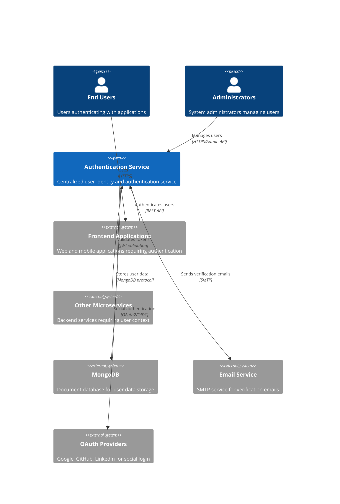
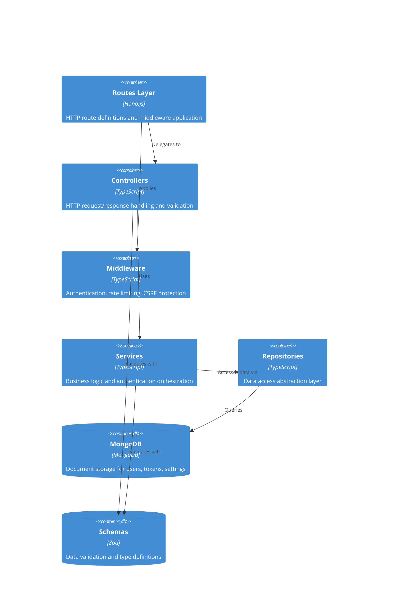

# Authentication Service Architecture

## System Context

This authentication service acts as the centralized identity authority for a microservices ecosystem, providing authentication and user management capabilities that other services depend on. It integrates with MongoDB for persistent data storage, external email services for user verification, and OAuth providers for social login capabilities.



## Container Architecture

The service follows a strict 6-layer architecture pattern that enforces clear separation of concerns and unidirectional data flow. This layered approach ensures maintainability, testability, and scalability for production deployment.



### 6-Layer Architecture Details

#### 1. Routes Layer (`src/routes/`)

- **Purpose**: HTTP route definitions and middleware orchestration
- **Responsibilities**: URL pattern matching, middleware composition, request routing
- **Pattern**: Feature-based route modules (auth, user, admin, oauth)
- **Key Characteristics**: Thin routing logic, middleware application order, rate limiting configuration

#### 2. Controllers Layer (`src/controllers/`)

- **Purpose**: HTTP request/response handling and API contract enforcement
- **Responsibilities**: Request parsing, response formatting, HTTP status codes, error mapping
- **Pattern**: Thin controllers that delegate business logic to services
- **Key Characteristics**: No business logic, uses pre-validated data from middleware, sanitizes responses

#### 3. Middleware Layer (`src/middlewares/`)

- **Purpose**: Cross-cutting concerns and request preprocessing
- **Responsibilities**: Authentication, authorization, validation, rate limiting, CSRF protection
- **Pattern**: Composable middleware functions with context modification
- **Key Characteristics**: Stateless operations, request enrichment, early termination on failures

#### 4. Services Layer (`src/services/`)

- **Purpose**: Business logic orchestration and authentication workflows
- **Responsibilities**: User registration, login flows, token management, email verification, OAuth integration
- **Pattern**: Interface-based services with dependency injection
- **Key Characteristics**: Core business rules, transaction coordination, external service integration

#### 5. Repositories Layer (`src/repositories/`)

- **Purpose**: Data access abstraction and persistence operations
- **Responsibilities**: Database queries, data mapping, transaction management
- **Pattern**: Interface segregation with MongoDB and MockDB implementations
- **Key Characteristics**: Database-agnostic interfaces, entity mapping, query optimization

#### 6. Schemas Layer (`src/schemas/`)

- **Purpose**: Data structure definitions and validation rules
- **Responsibilities**: Type definitions, runtime validation, API contracts
- **Pattern**: Zod schemas with TypeScript type inference
- **Key Characteristics**: Single source of truth, automatic type generation, runtime safety

### Architectural Flow Patterns

**Request Processing Flow**:

```plaintext
HTTP Request → Routes → Middleware → Controllers → Services → Repositories → Database
HTTP Response ← Routes ← Middleware ← Controllers ← Services ← Repositories ← Database
```

**Data Flow Principles**:

- **Unidirectional**: Each layer only communicates with adjacent layers
- **Interface-Based**: Dependencies use interfaces, not concrete implementations
- **Schema-Validated**: All data validated at boundaries using Zod schemas
- **Error Propagation**: Errors bubble up through layers with appropriate context

## Technology Stack

### Core Technologies

- **Runtime**: Node.js (v24+)
- **Language**: TypeScript (v5.8+) with strict type checking
- **Framework**: Hono.js (v4.7+) - Modern, lightweight web framework
- **Database**: MongoDB - Document-based NoSQL database for user data
- **Package Manager**: pnpm (preferred for performance and disk efficiency)
- **Module System**: ES Modules (`"type": "module"` in package.json)

### Development Tools

- **Build Tool**: Tsup (production builds) + tsx (development with hot reload)
- **Linter**: ESLint v9 with TypeScript ESLint plugin
- **Formatter**: Prettier with ESLint integration
- **Testing**: Vitest with coverage reporting and UI
- **Type Checking**: TypeScript compiler with strict settings

### Validation and Schemas

- **Schema Validation**: Zod (v3.25+) for runtime validation and type inference
- **Environment Variables**: Zod-validated environment configuration
- **Request/Response**: Schema-first API design with automatic type generation

### Development Environment

- **Editor**: VS Code with recommended extensions
- **Containerization**: Docker with development containers support
- **Debugging**: VS Code debugger with source map support
- **Hot Reload**: tsx watch for instant development feedback

## Design Patterns

### Core Architectural Patterns

#### 6-Layer Architecture

- **Structure**: Routes → Controllers → Middleware → Services → Repositories → Schemas
- **Benefits**: Clear separation of concerns, testability, maintainability
- **Enforcement**: Each layer has specific responsibilities and cannot skip layers
- **Testing**: Each layer can be tested in isolation with mocked dependencies

#### Repository Pattern with Interface Segregation

- **Abstraction**: Database operations hidden behind interfaces
- **Implementations**: MongoDB for production, MockDB for testing
- **Benefits**: Database-agnostic business logic, easy testing, future extensibility
- **Pattern**: `IUserRepository` → `MongoDbUserRepository` | `MockDbUserRepository`

#### Schema-First Design

- **Foundation**: All data structures defined with Zod schemas
- **Type Safety**: Automatic TypeScript type inference from schemas
- **Validation**: Runtime validation at API boundaries
- **Benefits**: Single source of truth, compile-time and runtime safety

### Security Patterns

#### Progressive Account Lockout

- **Strategy**: Exponential backoff for failed login attempts
- **Implementation**: 5 attempts → 30min, 6 attempts → 60min, 7 attempts → 120min
- **Recovery**: Time-based automatic unlock with audit trail
- **Benefits**: Brute force protection while maintaining user experience

#### Multi-Mode Authentication

- **JWT Mode**: Stateless tokens for SPAs and mobile apps
- **Session Mode**: Server-side sessions for traditional web applications
- **Token Management**: Refresh token rotation with database storage
- **Security**: Immediate revocation, multi-device session management

#### Defense in Depth

- **Rate Limiting**: Per-endpoint and per-IP protection
- **Input Validation**: Comprehensive schema validation at all boundaries
- **CSRF Protection**: Token-based protection for state-changing operations
- **Password Security**: Argon2id hashing with proper parameters

### Integration Patterns

#### Event-Driven Architecture

- **Events**: Authentication events emitted for monitoring and integration
- **Decoupling**: Services communicate through events rather than direct calls
- **Scalability**: Foundation for future microservices architecture
- **Monitoring**: Real-time authentication event streaming

#### OAuth Integration

- **Provider Abstraction**: Unified interface for multiple OAuth providers
- **Account Linking**: Smart email-based account association
- **Security**: State validation and CSRF protection for OAuth flows
- **Extensibility**: Easy addition of new OAuth providers

### Key Architectural Decisions

1. **Dual Authentication Modes**: Supports both JWT token-based authentication for SPAs and session-based authentication for traditional web apps, providing flexibility for different application architectures
2. **MongoDB with Document Mapping**: Uses MongoDB for flexible user data storage with robust document-to-entity mapping that handles null/undefined conversion for TypeScript compatibility
3. **Interface-Based Dependencies**: All services depend on interfaces rather than concrete implementations, enabling comprehensive testing with mocks and future extensibility

## Development Principles

1. **Security by Design**: Every feature prioritizes security first with comprehensive input validation, secure token handling, progressive lockout systems, and defense-in-depth approaches to prevent authentication vulnerabilities
2. **Schema-First Development**: All data structures and APIs defined through Zod schemas ensuring runtime validation, automatic type generation, and single source of truth for data contracts across the entire application
3. **Interface-Driven Architecture**: Dependencies injected through interfaces enabling comprehensive testing with mocks, easy swapping of implementations, and maintainable code that can evolve with changing requirements
