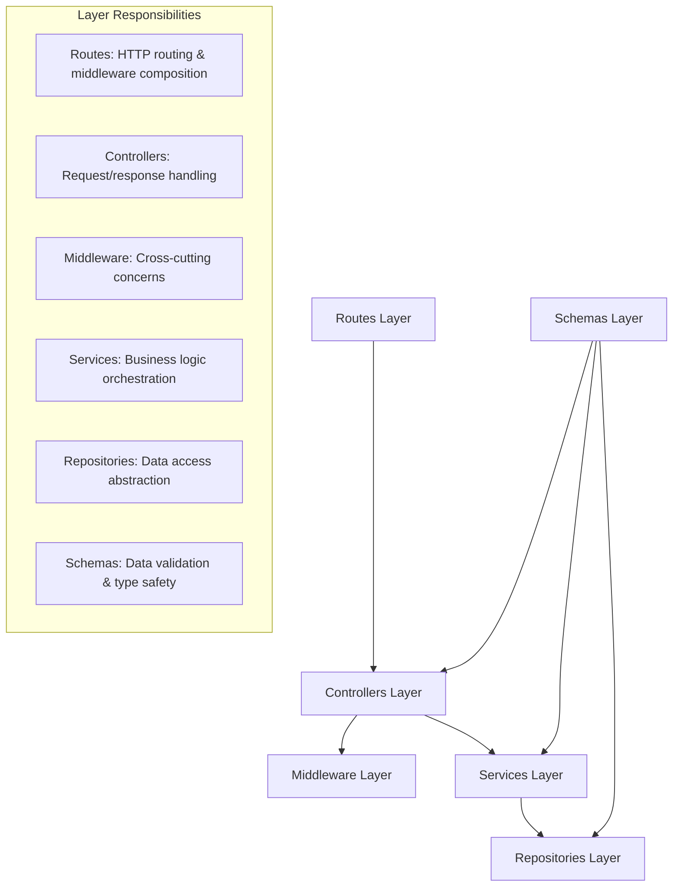
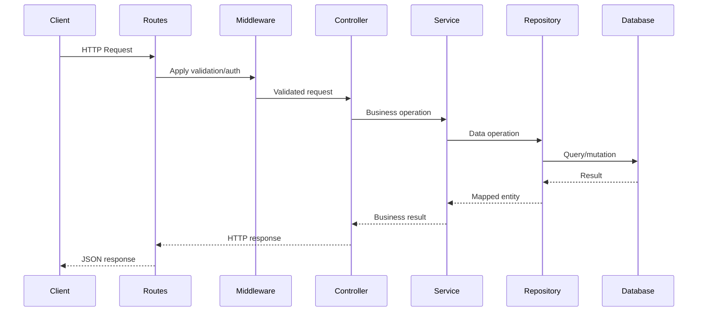

# Sprint 1: Core Foundation & Basic Authentication - Design

## Overview

This sprint establishes the foundational architecture for the authentication service using a strict 6-layer architecture pattern. The design prioritizes security, maintainability, and testability through interface-based dependency injection, comprehensive schema validation, and separation of concerns. The core authentication features include user registration, password-based login, JWT token management, and basic user profile operations.

## Architecture

### 6-Layer Architecture Implementation

The system implements a strict unidirectional 6-layer architecture:



### Data Flow Pattern



## Components and Interfaces

### Core Services

#### Authentication Service (`AuthenticationService`)

**Interface**: `IAuthenticationService`

**Responsibilities**:

- User registration with email/password validation
- Password-based authentication with progressive lockout
- JWT token generation and refresh token management
- Password change operations with current password verification
- Account lockout/unlock management

**Key Methods**:

```typescript
interface IAuthenticationService {
  register(
    data: RegisterUserType,
    config?: Partial<AuthServiceConfig>,
  ): Promise<RegistrationResult>;
  loginWithPassword(
    credentials: LoginCredentialsType,
    config?: Partial<AuthServiceConfig>,
  ): Promise<AuthenticationResult>;
  refreshTokens(refreshToken: string): Promise<TokenRefreshResult>;
  verifyAccessToken(accessToken: string): Promise<JWTPayloadType>;
  changePassword(
    userId: string,
    currentPassword: string,
    newPassword: string,
  ): Promise<void>;
  getUserFromToken(accessToken: string): Promise<UserType>;
}
```

**Configuration**:

- Progressive lockout with exponential backoff
- Configurable failed attempt thresholds
- Email verification requirements
- Token vs session mode selection

#### JWT Service (`JWTService`)

**Interface**: `IJWTService`

**Responsibilities**:

- Access token generation with user claims
- Refresh token generation and validation
- Token verification with comprehensive error handling
- Token pair generation for authentication flows

**Security Features**:

- HS256 algorithm with separate secrets for access/refresh tokens
- Configurable token expiry (15 minutes access, 7 days refresh)
- Token rotation on refresh to prevent replay attacks
- Comprehensive token validation with structured error handling

#### Password Service (`PasswordService`)

**Interface**: `IPasswordService`

**Responsibilities**:

- Argon2id password hashing with secure parameters
- Password strength validation with configurable policies
- Password verification with timing attack protection

**Security Configuration**:

- Argon2id with memory cost: 65536 KB, time cost: 3, parallelism: 4
- Configurable password policies (length, complexity, character requirements)
- Secure random salt generation

### Repository Layer

#### User Repository (`IUserRepository`)

**Implementations**:

- `MongoDbUserRepository`: Production MongoDB implementation
- `MockDbUserRepository`: In-memory testing implementation

**Key Operations**:

```typescript
interface IUserRepository {
  create(userData: CreateUserType): Promise<UserType>;
  findById(id: string): Promise<UserType | null>;
  findByEmail(email: string): Promise<UserType | null>;
  updateLoginAttempts(
    email: string,
    attempts: number,
    isLocked: boolean,
    lockUntil?: Date,
  ): Promise<void>;
  isAccountCurrentlyLocked(email: string): Promise<boolean>;
  updateLastLogin(userId: string): Promise<void>;
  updatePassword(userId: string, passwordHash: string): Promise<void>;
}
```

#### Refresh Token Repository (`IRefreshTokenRepository`)

**Responsibilities**:

- Secure refresh token storage with SHA-256 hashing
- Token rotation and revocation management
- User-based token cleanup operations

### Controller Layer

#### Auth Controller (`AuthController`)

**Endpoints**:

- `POST /auth/register` - User registration
- `POST /auth/login` - Password-based authentication
- `POST /auth/refresh` - Token refresh
- `GET /auth/me` - Current user information
- `POST /auth/logout` - Token revocation
- `GET /auth/health` - Service health check

**Validation**:

- Zod schema validation for all request bodies
- Comprehensive error handling with appropriate HTTP status codes
- Request sanitization and response formatting

#### User Controller (`UserController`)

**Endpoints**:

- `GET /me` - User profile retrieval
- `PUT /me` - Profile updates
- `PUT /me/password` - Password change
- `DELETE /me` - Account deletion

## Data Models

### User Entity

```typescript
interface UserType {
  id: string; // Primary identifier
  firstName?: string; // Optional first name
  lastName?: string; // Optional last name
  primaryEmail: string; // Primary email address
  passwordHash?: string; // Argon2id hash (optional for social-only accounts)
  globalRole: GlobalRoleType; // System role (student, teacher, admin, user)
  emails: EmailObjectType[]; // Array of email addresses with verification status
  socialIdentities: SocialIdentityObjectType[]; // Social login connections
  lastLoginAt?: Date; // Last successful login timestamp
  passwordLastChangedAt?: Date; // Password change tracking
  isAccountLocked: boolean; // Account lock status
  failedLoginAttempts: number; // Failed login counter
  accountLockedAt?: Date; // Lock timestamp
  accountLockedUntil?: Date; // Progressive lockout expiry
  createdAt?: Date; // Account creation timestamp
  updatedAt?: Date; // Last modification timestamp
}
```

### Email Object (Embedded)

```typescript
interface EmailObjectType {
  emailAddress: string; // Email address
  isVerified: boolean; // Verification status
  verificationToken?: string; // Verification token (excluded from API responses)
  verificationTokenExpiresAt?: Date; // Token expiry
  addedAt: Date; // Addition timestamp
}
```

### Refresh Token Entity

```typescript
interface RefreshTokenType {
  id: string; // Primary identifier
  tokenHash: string; // SHA-256 hash of refresh token
  userId: string; // User reference
  userAgent?: string; // Client user agent
  ipAddress?: string; // Client IP address
  expiresAt: Date; // Token expiry
  isRevoked: boolean; // Revocation status
  createdAt?: Date; // Creation timestamp
}
```

### JWT Payload Structure

```typescript
interface JWTPayloadType {
  userId: string; // User identifier
  email: string; // Primary email
  role: GlobalRoleType; // User role
  iat: number; // Issued at timestamp
  exp: number; // Expiry timestamp
}
```

## Error Handling

### Custom Error Classes

```typescript
class UnauthenticatedError extends Error        // 401 - Authentication required
class InvalidCredentialsError extends Error    // 401 - Invalid login credentials
class UserAlreadyExistsError extends Error     // 409 - Duplicate user registration
class AccountLockedError extends Error         // 423 - Account locked due to failed attempts
class EmailNotVerifiedError extends Error     // 403 - Email verification required
class NotFoundError extends Error             // 404 - Resource not found
class BadRequestError extends Error           // 400 - Invalid request data
```

### Global Error Handler

- Centralized error processing with appropriate HTTP status mapping
- Error sanitization to prevent information leakage
- Structured error responses with consistent format
- Development vs production error detail levels

### Progressive Lockout Logic

```typescript
// Lockout duration calculation
const calculateLockoutDuration = (
  attempts: number,
  config: AuthServiceConfig,
): number => {
  const baseAttempts = config.maxFailedAttempts;
  const excessAttempts = Math.max(0, attempts - baseAttempts);
  const multiplier = Math.pow(2, excessAttempts);
  const baseDurationMs = config.lockoutDurationMinutes * 60 * 1000;
  const calculatedDuration = multiplier * baseDurationMs;
  const maxDurationMs = config.maxProgressiveLockoutHours * 60 * 60 * 1000;
  return Math.min(calculatedDuration, maxDurationMs);
};
```

## Testing Strategy

### Unit Testing Approach

**Service Layer Testing**:

- Mock repository dependencies using interfaces
- Test business logic in isolation
- Comprehensive error condition coverage
- Password hashing and verification testing

**Repository Testing**:

- Dual implementation testing (MongoDB + MockDB)
- Data persistence and retrieval validation
- Query optimization and error handling
- Connection management testing

**Controller Testing**:

- HTTP request/response validation
- Schema validation testing
- Error response formatting
- Authentication middleware integration

### Integration Testing

**Authentication Flows**:

- End-to-end registration and login flows
- Token generation and validation cycles
- Progressive lockout behavior verification
- Password change and account management

**Database Integration**:

- MongoDB connection and query testing
- Transaction handling and rollback scenarios
- Data consistency and integrity validation

### Test Data Management

**MockDB Implementation**:

- In-memory data storage for fast testing
- Repository interface compliance
- Consistent behavior with MongoDB implementation
- Test isolation and cleanup

**Test Fixtures**:

- Predefined user data for consistent testing
- Password hash generation for authentication tests
- Token generation for authorization testing

## Security Considerations

### Password Security

- **Argon2id Hashing**: Memory-hard function resistant to GPU attacks
- **Secure Parameters**: 64MB memory, 3 iterations, 4 parallelism
- **Salt Generation**: Cryptographically secure random salts
- **Timing Attack Protection**: Consistent verification timing

### Token Security

- **Separate Secrets**: Different secrets for access and refresh tokens
- **Token Rotation**: Refresh tokens invalidated on use
- **Secure Storage**: Refresh tokens hashed with SHA-256 in database
- **Expiry Management**: Short-lived access tokens (15 minutes)

### Account Protection

- **Progressive Lockout**: Exponential backoff for failed attempts
- **Time-based Unlocking**: Automatic account unlock after lockout period
- **Attempt Tracking**: Comprehensive failed login monitoring
- **Account Status Validation**: Real-time lockout status checking

### Input Validation

- **Schema-First Validation**: Zod schemas for all data boundaries
- **Email Format Validation**: RFC-compliant email validation
- **Password Strength**: Configurable complexity requirements
- **Request Sanitization**: Input cleaning and normalization

## Configuration Management

### Environment Variables

```typescript
interface AppEnvType {
  NODE_ENV: "development" | "production" | "test";
  PORT: number;
  MONGODB_URI: string;
  JWT_ACCESS_SECRET: string;
  JWT_REFRESH_SECRET: string;
  JWT_ACCESS_EXPIRY_MINUTES: number;
  JWT_REFRESH_EXPIRY_DAYS: number;
}
```

### Service Configuration

```typescript
interface AuthServiceConfig {
  maxFailedAttempts: number; // Failed login threshold (default: 5)
  lockoutDurationMinutes: number; // Base lockout duration (default: 30)
  requireEmailVerification: boolean; // Email verification requirement
  tokenMode: boolean; // JWT vs session mode
  progressiveLockout: boolean; // Enable exponential backoff
  maxProgressiveLockoutHours: number; // Maximum lockout duration (default: 24)
}
```

### Database Configuration

- MongoDB connection with retry logic
- Connection pooling and timeout configuration
- Graceful shutdown with connection cleanup
- Environment-based database selection (production vs test)

## Performance Considerations

### Token Operations

- **Fast Token Hashing**: SHA-256 for refresh token storage (not Argon2id)
- **Efficient Lookups**: Indexed token hash queries
- **Batch Operations**: Bulk token revocation capabilities
- **Memory Management**: Proper cleanup of expired tokens

### Database Optimization

- **Indexed Queries**: Email and user ID indexes for fast lookups
- **Connection Pooling**: Efficient connection reuse
- **Query Optimization**: Minimal data transfer with projection
- **Batch Operations**: Bulk user operations where applicable

### Caching Strategy

- **In-Memory Validation**: JWT signature verification without database calls
- **User Context Caching**: Temporary user data caching for request duration
- **Schema Compilation**: Zod schema compilation optimization
