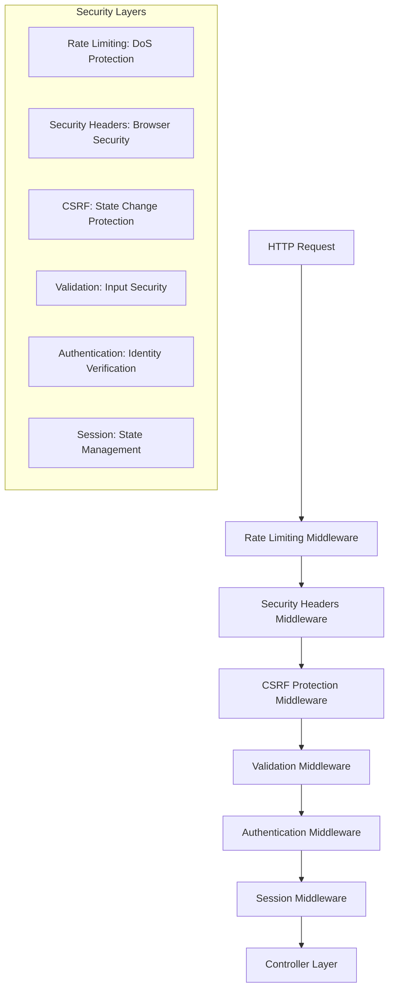
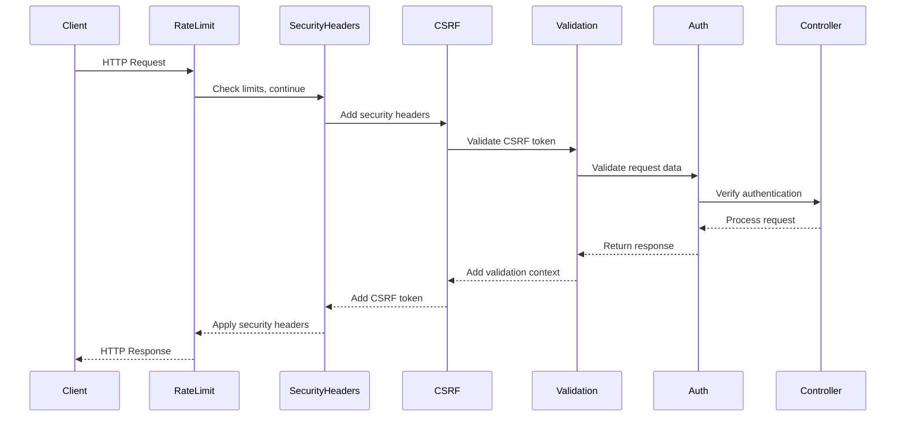

# Sprint 2: Security & Protection Systems - Design

## Overview

This sprint implements a comprehensive security middleware layer that provides defense-in-depth protection for the authentication service. The design focuses on creating modular, configurable security components that can be composed together to provide multiple layers of protection against common web vulnerabilities and attacks. Each security component is designed to be independently testable and configurable for different deployment environments.

## Architecture

### Security Middleware Stack

The security system implements a layered middleware architecture where each layer provides specific protection:



### Middleware Composition Pattern



## Components and Interfaces

### Rate Limiting System

#### Rate Limit Middleware (`RateLimitMiddleware`)

**Core Interface**:

```typescript
interface RateLimitConfig {
  windowMinutes: number;
  maxRequests: number;
  keyGenerator?: (c: Context) => string;
  skipSuccessfulRequests?: boolean;
  skipFailedRequests?: boolean;
  message?: string;
}

interface RateLimitStore {
  get(key: string): Promise<number | null>;
  set(key: string, value: number, ttlSeconds: number): Promise<void>;
  increment(key: string, ttlSeconds: number): Promise<number>;
  delete(key: string): Promise<void>;
  reset(): Promise<void>;
}
```

**Key Features**:

- **Sliding Window**: Time-based request counting with automatic cleanup
- **Flexible Key Generation**: IP + User-Agent combination for client identification
- **Memory Store**: Efficient in-memory storage with TTL support
- **Configurable Thresholds**: Different limits for auth vs general endpoints
- **Request Filtering**: Optional exclusion of successful/failed requests

**Rate Limiting Strategy**:

```typescript
// General API endpoints: 100 requests per 15 minutes
const generalRateLimit = {
  windowMinutes: 15,
  maxRequests: 100,
};

// Authentication endpoints: 5 requests per 15 minutes
const authRateLimit = {
  windowMinutes: 15,
  maxRequests: 5,
  message: "Too many authentication attempts. Please try again later.",
};
```

#### Memory Rate Limit Store

**Implementation Details**:

- **Automatic Cleanup**: Expired entries removed on access
- **Efficient Storage**: Map-based storage with expiry timestamps
- **Thread Safety**: Atomic operations for increment/decrement
- **Memory Management**: Bounded storage with LRU-style cleanup

### CSRF Protection System

#### CSRF Service (`CSRFService`)

**Interface**:

```typescript
interface ICSRFService {
  generateToken(): CSRFTokenData;
  validateToken(token: string, hash: string, maxAgeMs?: number): boolean;
  generateSecureToken(length: number): string;
}

interface CSRFTokenData {
  token: string;
  hash: string;
  timestamp: number;
}
```

**Security Design**:

- **Double Submit Cookie Pattern**: Token in cookie + validation hash in separate cookie
- **HMAC Validation**: SHA-256 HMAC with secret key and timestamp
- **Timing Attack Protection**: Constant-time comparison for validation
- **Token Rotation**: Fresh tokens generated for each safe request

#### CSRF Middleware (`CSRFMiddleware`)

**Protection Flow**:

```typescript
// Safe methods (GET, HEAD, OPTIONS): Generate and set tokens
if (isSafeMethod) {
  const tokenData = csrfService.generateToken();
  setCookie(c, "csrf-token", tokenData.token, { httpOnly: false });
  setCookie(c, "csrf-token-hash", tokenData.hash, { httpOnly: true });
}

// Unsafe methods (POST, PUT, DELETE): Validate tokens
if (isUnsafeMethod) {
  const token = getTokenFromHeaderOrBody(c);
  const hash = getCookie(c, "csrf-token-hash");
  if (!csrfService.validateToken(token, hash, maxAge)) {
    throw new CSRFError("Invalid CSRF token");
  }
}
```

**Token Extraction Strategy**:

1. **Header**: `X-CSRF-Token` header (preferred)
2. **JSON Body**: `_csrf` field in JSON requests
3. **Form Data**: `_csrf` field in form submissions
4. **Multipart**: `_csrf` field in multipart forms

### Security Headers System

#### Security Headers Middleware (`SecurityHeadersMiddleware`)

**Comprehensive Header Configuration**:

```typescript
interface SecurityHeadersConfig {
  hsts?: {
    maxAge: number;
    includeSubDomains: boolean;
    preload: boolean;
  };
  contentSecurityPolicy?: {
    defaultSrc: string[];
    scriptSrc: string[];
    styleSrc: string[];
    // ... other CSP directives
  };
  frameOptions?: "DENY" | "SAMEORIGIN" | string;
  contentTypeOptions?: "nosniff";
  referrerPolicy?: string;
  permissionsPolicy?: Record<string, string[]>;
}
```

**Production Security Headers**:

```typescript
const productionHeaders = {
  // HSTS: Force HTTPS for 1 year
  hsts: {
    maxAge: 31536000,
    includeSubDomains: true,
    preload: false,
  },

  // CSP: Strict content policy
  contentSecurityPolicy: {
    defaultSrc: ["'self'"],
    scriptSrc: ["'self'"],
    styleSrc: ["'self'", "'unsafe-inline'"],
    imgSrc: ["'self'", "data:", "https:"],
    connectSrc: ["'self'"],
    objectSrc: ["'none'"],
    frameAncestors: ["'none'"],
  },

  // Frame protection
  frameOptions: "DENY",

  // MIME sniffing protection
  contentTypeOptions: "nosniff",

  // Referrer policy
  referrerPolicy: "strict-origin-when-cross-origin",
};
```

**Development vs Production Configuration**:

- **Development**: Relaxed CSP for hot reload, no HSTS, eval allowed
- **Production**: Strict CSP, HSTS enabled, no unsafe directives

### Input Validation System

#### Validation Middleware (`ValidationMiddleware`)

**Flexible Validation Interface**:

```typescript
interface ValidationOptions {
  schema: ZodTypeAny;
  source: "body" | "query" | "params";
  varKey: string;
}

const validate = (options: ValidationOptions): MiddlewareHandler => {
  return async (c, next) => {
    const data = await extractData(c, options.source);
    const result = options.schema.safeParse(data);

    if (!result.success) {
      throw new BadRequestError(formatValidationErrors(result.error));
    }

    c.set(options.varKey, result.data);
    await next();
  };
};
```

**Data Source Handling**:

- **Body Validation**: JSON parsing with error handling
- **Query Validation**: URL parameter extraction and coercion
- **Params Validation**: Path parameter validation
- **Error Formatting**: Field-level error messages with context

**Usage Pattern**:

```typescript
app.post(
  "/auth/register",
  validate({
    schema: registerUserSchema,
    source: "body",
    varKey: "validatedBody",
  }),
  authController.register,
);
```

### Authentication Middleware Enhancement

#### Enhanced Auth Middleware (`AuthMiddleware`)

**Token Processing Flow**:

```typescript
const authMiddleware = createMiddleware(async (c, next) => {
  // Extract token from Authorization header
  const authHeader = c.req.header("Authorization");
  const token = extractBearerToken(authHeader);

  // Validate token and get user context
  const user = await authenticationService.getUserFromToken(token);

  // Inject user context into request
  c.set("user", {
    userId: user.id,
    primaryEmail: user.primaryEmail,
    globalRole: user.globalRole,
  });

  await next();
});
```

**Security Validations**:

- **Token Format**: Bearer token format validation
- **Token Expiry**: JWT expiration checking
- **User Status**: Account lock status validation
- **Token Revocation**: Refresh token blacklist checking

### Session Management System

#### Session Middleware (`SessionMiddleware`)

**Session Configuration**:

```typescript
interface SessionConfig {
  secret: string;
  maxAgeHours: number;
  secure: boolean;
  httpOnly: boolean;
  sameSite: "strict" | "lax" | "none";
  cookieName: string;
}

const sessionConfig = {
  secret: env.SESSION_SECRET,
  maxAgeHours: env.SESSION_MAX_AGE_HOURS,
  secure: env.NODE_ENV === "production",
  httpOnly: true,
  sameSite: "strict",
  cookieName: "auth-session",
};
```

**Session Security Features**:

- **Secure Identifiers**: Cryptographically random session IDs
- **Cookie Security**: HttpOnly, Secure, SameSite attributes
- **Session Rotation**: New session ID on authentication
- **Automatic Cleanup**: Expired session removal

## Data Models

### Rate Limit Entry

```typescript
interface RateLimitEntry {
  key: string; // Client identifier (IP + User-Agent)
  count: number; // Request count in current window
  windowStart: number; // Window start timestamp
  expires: number; // Entry expiration timestamp
}
```

### CSRF Token Data

```typescript
interface CSRFTokenData {
  token: string; // Client-visible CSRF token
  hash: string; // Server-side validation hash
  timestamp: number; // Token generation timestamp
}
```

### Security Event Log

```typescript
interface SecurityEvent {
  type: "rate_limit" | "csrf_violation" | "auth_failure";
  timestamp: Date;
  clientId: string; // IP + User-Agent
  details: Record<string, unknown>;
  severity: "low" | "medium" | "high";
}
```

## Error Handling

### Security-Specific Errors

```typescript
class TooManyRequestsError extends BaseError {
  constructor(
    message: string,
    public retryAfter?: number,
  ) {
    super(message, { errorCode: 429 });
  }
}

class CSRFError extends UnauthenticatedError {
  constructor(message: string = "Invalid CSRF token") {
    super(message, { errorCode: 401 });
  }
}

class ValidationError extends BadRequestError {
  constructor(
    message: string,
    public fieldErrors?: Record<string, string[]>,
  ) {
    super(message, { errorCode: 400 });
  }
}
```

### Error Response Format

```typescript
interface SecurityErrorResponse {
  error: string;
  code: number;
  details?: {
    retryAfter?: number; // For rate limiting
    fieldErrors?: Record<string, string[]>; // For validation
    csrfToken?: string; // For CSRF failures
  };
  timestamp: string;
}
```

## Testing Strategy

### Unit Testing Approach

**Rate Limiting Tests**:

- **Window Behavior**: Sliding window request counting
- **Key Generation**: Client identification logic
- **Store Operations**: Memory store CRUD operations
- **Cleanup Logic**: Expired entry removal

**CSRF Protection Tests**:

- **Token Generation**: Secure random token creation
- **HMAC Validation**: Hash verification with timing safety
- **Token Extraction**: Multi-source token parsing
- **Age Validation**: Token expiry checking

**Security Headers Tests**:

- **Header Generation**: CSP, HSTS, frame options
- **Environment Configuration**: Dev vs prod settings
- **Custom Headers**: Additional security headers

### Integration Testing

**Middleware Composition**:

- **Request Flow**: End-to-end security middleware chain
- **Error Propagation**: Security error handling
- **Context Injection**: User context and validation data

**Security Scenarios**:

- **Attack Simulation**: CSRF, XSS, clickjacking attempts
- **Rate Limit Enforcement**: Burst and sustained traffic
- **Authentication Bypass**: Token manipulation attempts

### Security Testing

**Penetration Testing Scenarios**:

- **CSRF Attacks**: Cross-site request forgery attempts
- **XSS Injection**: Script injection in various contexts
- **Rate Limit Bypass**: Distributed and rotating attacks
- **Header Manipulation**: Security header bypass attempts

## Performance Considerations

### Rate Limiting Performance

**Memory Efficiency**:

- **Bounded Storage**: Maximum entry limits with LRU cleanup
- **Efficient Lookups**: Hash-based key storage
- **Batch Cleanup**: Periodic expired entry removal
- **Memory Monitoring**: Usage tracking and alerts

### CSRF Token Performance

**Token Operations**:

- **Fast Generation**: Efficient random number generation
- **Quick Validation**: Optimized HMAC verification
- **Minimal Storage**: Stateless token design
- **Cache Efficiency**: Token reuse for safe requests

### Security Headers Performance

**Header Optimization**:

- **Static Headers**: Pre-computed header values
- **Conditional Logic**: Environment-based header selection
- **Minimal Processing**: Efficient header composition
- **Response Caching**: Header template caching

## Security Considerations

### Defense in Depth

**Multiple Protection Layers**:

1. **Network Level**: Rate limiting and IP filtering
2. **Application Level**: CSRF and input validation
3. **Browser Level**: Security headers and CSP
4. **Session Level**: Secure session management

### Attack Mitigation

**Common Attack Vectors**:

- **DoS/DDoS**: Rate limiting with exponential backoff
- **CSRF**: Double-submit cookie pattern with HMAC
- **XSS**: Content Security Policy and input sanitization
- **Clickjacking**: Frame-ancestors and X-Frame-Options
- **Session Hijacking**: Secure cookies and session rotation

### Security Monitoring

**Event Logging**:

- **Attack Attempts**: Failed CSRF validations, rate limit violations
- **Suspicious Patterns**: Unusual request patterns, header manipulation
- **Security Metrics**: Attack frequency, success rates, client patterns
- **Alert Triggers**: Threshold-based security alerts

## Configuration Management

### Environment-Based Security

**Development Configuration**:

```typescript
const devSecurityConfig = {
  rateLimiting: { enabled: true, relaxed: true },
  csrf: { enabled: true, strict: false },
  headers: { csp: "relaxed", hsts: false },
  validation: { strict: false, detailed: true },
};
```

**Production Configuration**:

```typescript
const prodSecurityConfig = {
  rateLimiting: { enabled: true, strict: true },
  csrf: { enabled: true, strict: true },
  headers: { csp: "strict", hsts: true },
  validation: { strict: true, minimal: true },
};
```

### Security Policy Management

**Configurable Policies**:

- **Rate Limits**: Per-endpoint and per-client thresholds
- **CSRF Settings**: Token lifetime and validation strictness
- **CSP Policies**: Content source allowlists
- **Session Security**: Cookie attributes and lifetime
