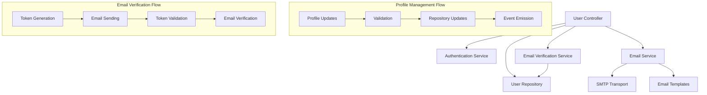
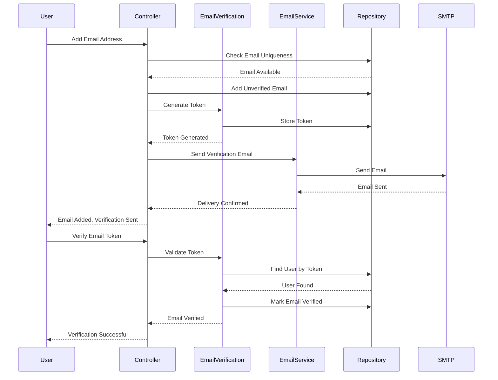

# Sprint 3: User Management & Profile Features - Design

## Overview

This sprint implements comprehensive user profile management and email verification capabilities that provide users with full control over their account information and email addresses. The design focuses on creating secure, user-friendly interfaces for profile management while maintaining data integrity and security throughout all operations. The system supports multiple email addresses per user with independent verification workflows and provides robust email delivery infrastructure.

## Architecture

### User Management System Architecture

The user management system extends the existing 6-layer architecture with specialized services for profile management and email verification:



### Email Verification Workflow



## Components and Interfaces

### User Controller Enhancement

#### Extended User Controller (`UserController`)

**Core Interface**:

```typescript
interface IUserController {
  getProfile(c: Context): Promise<Response>;
  updateProfile(c: Context): Promise<Response>;
  changePassword(c: Context): Promise<Response>;
  getEmails(c: Context): Promise<Response>;
  addEmail(c: Context): Promise<Response>;
  removeEmail(c: Context): Promise<Response>;
  setPrimaryEmail(c: Context): Promise<Response>;
  resendEmailVerification(c: Context): Promise<Response>;
  deleteAccount(c: Context): Promise<Response>;
  getAccountSummary(c: Context): Promise<Response>;
}
```

**Profile Management Features**:

- **Profile Retrieval**: Sanitized user data with security filtering
- **Profile Updates**: Validated field updates with audit trails
- **Account Summary**: Comprehensive account status and statistics
- **Account Deletion**: Secure account removal with password confirmation

**Email Management Features**:

- **Multiple Emails**: Support for multiple email addresses per user
- **Email Verification**: Independent verification workflow for each email
- **Primary Email**: Designation of primary email with verification requirements
- **Email Operations**: Add, remove, and manage email addresses

### Email Verification Service

#### Email Verification Service (`EmailVerificationService`)

**Interface**:

```typescript
interface IEmailVerificationService {
  generateVerificationToken(
    userId: string,
    emailAddress: string,
    config?: Partial<EmailVerificationConfig>,
  ): Promise<EmailVerificationTokenResult>;
  verifyEmailToken(
    token: string,
    config?: Partial<EmailVerificationConfig>,
  ): Promise<EmailVerificationResult>;
  resendVerificationEmail(
    userId: string,
    emailAddress: string,
    config?: Partial<EmailVerificationConfig>,
  ): Promise<ResendVerificationResult>;
  isTokenExpired(expiresAt: Date): boolean;
  isTokenValid(token: string): boolean;
  generateSecureToken(length?: number): string;
  findUserByVerificationToken(token: string): Promise<UserType | null>;
}
```

**Token Management**:

```typescript
interface EmailVerificationConfig {
  tokenExpiryHours: number; // Default: 24 hours
  tokenLength: number; // Default: 64 characters
  maxResendAttempts: number; // Default: 3 per hour
  resendCooldownMinutes: number; // Default: 5 minutes
}
```

**Security Features**:

- **Secure Token Generation**: Cryptographically secure random tokens using UUID + crypto.randomBytes
- **Token Validation**: Format validation, expiry checking, and user association verification
- **Cooldown Protection**: Rate limiting for verification email resends
- **Token Cleanup**: Automatic cleanup of expired verification tokens

#### Token Generation Algorithm

```typescript
generateSecureToken(length: number): string {
  // Combine UUID and crypto random for maximum entropy
  const uuid = uuidv4().replace(/-/g, '')
  const randomBytes = crypto.randomBytes(Math.ceil(length / 2))
  const randomHex = randomBytes.toString('hex')

  // Combine and truncate to desired length
  const combined = uuid + randomHex
  return combined.substring(0, length)
}
```

### Email Service System

#### Email Service (`EmailService`)

**Interface**:

```typescript
interface IEmailService {
  sendVerificationEmail(
    userId: string,
    emailAddress: string,
    token: string,
    firstName?: string,
  ): Promise<EmailSendResult>;
  sendPasswordResetEmail(
    userId: string,
    emailAddress: string,
    token: string,
    firstName?: string,
  ): Promise<EmailSendResult>;
  sendWelcomeEmail(
    emailAddress: string,
    firstName?: string,
  ): Promise<EmailSendResult>;
  sendRawEmail(options: EmailSendOptions): Promise<EmailSendResult>;
  isHealthy(): Promise<boolean>;
}
```

**SMTP Configuration**:

```typescript
interface EmailServiceConfig {
  host: string; // SMTP server hostname
  port: number; // SMTP server port
  secure: boolean; // Use TLS/SSL
  auth?: {
    // SMTP authentication
    user: string;
    pass: string;
  };
  fromAddress: string; // Default sender address
  fromName: string; // Default sender name
  maxRetries: number; // Retry attempts (default: 3)
  retryDelayMs: number; // Base retry delay (default: 1000ms)
}
```

**Retry Logic with Exponential Backoff**:

```typescript
async sendEmailWithRetry(options: EmailSendOptions): Promise<EmailSendResult> {
  for (let attempt = 1; attempt <= maxRetries; attempt++) {
    try {
      return await this.transporter.sendMail(options)
    } catch (error) {
      if (attempt < maxRetries) {
        // Exponential backoff: 2^(attempt-1) * base delay
        const delay = Math.pow(2, attempt - 1) * retryDelayMs
        await this.delay(delay)
      }
    }
  }
  throw new Error('Email sending failed after all retry attempts')
}
```

#### Mock Email Service for Testing

```typescript
class MockEmailService implements IEmailService {
  private sentEmails: Array<{
    type: string;
    to: string;
    subject: string;
    content: string;
    sentAt: Date;
  }> = [];

  // Testing utilities
  getSentEmails(): Array<SentEmail>;
  getLastEmail(): SentEmail | undefined;
  getEmailsByType(type: string): Array<SentEmail>;
  clearSentEmails(): void;
}
```

### Email Template System

#### Template Engine

**Template Interface**:

```typescript
interface EmailTemplate {
  subject: string;
  html: string;
  text: string;
}

interface VerificationEmailData {
  firstName?: string;
  verificationUrl: string;
  expiresInHours: number;
}
```

**Template Features**:

- **Professional Design**: Clean, responsive HTML templates with inline CSS
- **Personalization**: Dynamic content with user names and custom data
- **Security Information**: Clear expiry times and security warnings
- **Accessibility**: Both HTML and plain text versions for all templates
- **Branding**: Consistent visual identity and messaging

**Template Rendering**:

```typescript
function renderTemplate(
  template: string,
  data: Record<string, unknown>,
): string {
  return template.replace(/\{\{(\w+)\}\}/g, (match, key) => {
    return data[key] !== undefined ? String(data[key]) : match;
  });
}
```

#### URL Generation

```typescript
function generateVerificationUrl(token: string): string {
  const baseUrl = env.FRONTEND_URL;
  return `${baseUrl}/verify-email?token=${encodeURIComponent(token)}`;
}

function generatePasswordResetUrl(token: string): string {
  const baseUrl = env.FRONTEND_URL;
  return `${baseUrl}/reset-password?token=${encodeURIComponent(token)}`;
}
```

## Data Models

### Extended User Model

```typescript
interface UserType {
  id: string;
  firstName?: string;
  lastName?: string;
  primaryEmail: string;
  passwordHash?: string;
  globalRole: GlobalRoleType;
  emails: EmailObjectType[]; // Multiple email support
  socialIdentities: SocialIdentityObjectType[];
  lastLoginAt?: Date;
  passwordLastChangedAt?: Date;
  isAccountLocked: boolean;
  failedLoginAttempts: number;
  accountLockedAt?: Date;
  accountLockedUntil?: Date;
  createdAt?: Date;
  updatedAt?: Date;
}
```

### Email Object Model

```typescript
interface EmailObjectType {
  emailAddress: string; // Email address
  isVerified: boolean; // Verification status
  verificationToken?: string; // Current verification token
  verificationTokenExpiresAt?: Date; // Token expiry timestamp
  addedAt: Date; // When email was added
}
```

### Account Summary Model

```typescript
interface AccountSummary {
  userId: string;
  name: string; // Formatted full name
  primaryEmail: string;
  globalRole: GlobalRoleType;
  emailCount: number; // Total email addresses
  verifiedEmails: number; // Verified email count
  socialIdentities: number; // Connected social accounts
  accountStatus: {
    isLocked: boolean;
    failedLoginAttempts: number;
  };
  timestamps: {
    createdAt?: Date;
    lastLoginAt?: Date;
    passwordLastChangedAt?: Date;
  };
}
```

### Email Verification Results

```typescript
interface EmailVerificationResult {
  success: boolean;
  message: string;
  user?: UserType;
}

interface EmailVerificationTokenResult {
  token: string;
  expiresAt: Date;
  emailAddress: string;
}

interface ResendVerificationResult {
  success: boolean;
  message: string;
  emailAddress: string;
  expiresAt: Date;
  token: string;
}
```

## Error Handling

### User Management Errors

```typescript
class EmailAlreadyExistsError extends BadRequestError {
  constructor(message: string = "Email address already exists") {
    super(message, { errorCode: 409 });
  }
}

class EmailNotVerifiedError extends ForbiddenError {
  constructor(message: string = "Email address not verified") {
    super(message, { errorCode: 403 });
  }
}

class VerificationTokenExpiredError extends BadRequestError {
  constructor(message: string = "Verification token has expired") {
    super(message, { errorCode: 400 });
  }
}

class CooldownActiveError extends TooManyRequestsError {
  constructor(message: string, retryAfter: number) {
    super(message, retryAfter);
  }
}
```

### Email Service Errors

```typescript
class EmailDeliveryError extends InternalServerError {
  constructor(message: string = "Failed to send email") {
    super(message, { errorCode: 500 });
  }
}

class SMTPConnectionError extends ServiceUnavailableError {
  constructor(message: string = "Email service unavailable") {
    super(message, { errorCode: 503 });
  }
}
```

### Error Response Format

```typescript
interface UserManagementErrorResponse {
  error: string;
  code: number;
  details?: {
    field?: string; // For validation errors
    retryAfter?: number; // For cooldown errors
    suggestions?: string[]; // For resolution guidance
  };
  timestamp: string;
}
```

## Testing Strategy

### Unit Testing Approach

**User Controller Tests**:

- **Profile Operations**: CRUD operations with validation scenarios
- **Email Management**: Add, remove, verify, and set primary email workflows
- **Error Handling**: Invalid input, unauthorized access, and edge cases
- **Authentication Integration**: Token validation and user context injection

**Email Verification Service Tests**:

- **Token Generation**: Secure random generation and uniqueness
- **Token Validation**: Format checking, expiry validation, and user association
- **Cooldown Logic**: Rate limiting and resend attempt tracking
- **Cleanup Operations**: Expired token removal and maintenance

**Email Service Tests**:

- **SMTP Integration**: Connection testing and email sending
- **Retry Logic**: Exponential backoff and failure handling
- **Template Rendering**: Dynamic content generation and formatting
- **Mock Service**: Testing utilities and email capture

### Integration Testing

**Email Verification Workflow**:

- **End-to-End Flow**: Complete verification process from token generation to email confirmation
- **Multiple Email Support**: Adding and verifying multiple email addresses
- **Primary Email Management**: Setting and changing primary email addresses
- **Error Scenarios**: Invalid tokens, expired tokens, and duplicate emails

**Profile Management Integration**:

- **Complete User Lifecycle**: Registration, profile updates, email management, and account deletion
- **Security Validation**: Authentication requirements and authorization checks
- **Data Consistency**: Profile updates and email verification state management

### Email Testing

**Template Testing**:

- **Rendering Accuracy**: Dynamic content insertion and formatting
- **Cross-Client Compatibility**: HTML rendering across different email clients
- **Accessibility**: Plain text versions and screen reader compatibility
- **Security**: Link validation and token encoding

**Delivery Testing**:

- **SMTP Integration**: Real email delivery in staging environments
- **Mock Service**: Captured emails for automated testing
- **Retry Logic**: Failure simulation and recovery testing
- **Performance**: Email sending under load conditions

## Security Considerations

### Email Verification Security

**Token Security**:

- **Cryptographic Strength**: High-entropy token generation using crypto.randomBytes
- **Expiry Management**: Time-based token expiration with cleanup
- **Single Use**: Tokens invalidated after successful verification
- **Rate Limiting**: Cooldown periods for verification email requests

**Email Address Security**:

- **Uniqueness Validation**: Prevention of duplicate email addresses across users
- **Format Validation**: RFC-compliant email address validation
- **Domain Validation**: Optional domain whitelist/blacklist support
- **Normalization**: Consistent email address formatting and storage

### Profile Management Security

**Input Validation**:

- **Schema Validation**: Comprehensive Zod schema validation for all profile fields
- **Sanitization**: Input cleaning to prevent injection attacks
- **Length Limits**: Reasonable field length restrictions
- **Character Filtering**: Allowed character sets for different field types

**Authorization Controls**:

- **User Context**: Strict user identity verification for all operations
- **Operation Permissions**: Role-based access control for sensitive operations
- **Audit Trails**: Comprehensive logging of profile changes and email operations
- **Session Validation**: Active session requirements for sensitive operations

### Email Service Security

**SMTP Security**:

- **TLS Encryption**: Secure email transmission with TLS/SSL
- **Authentication**: SMTP server authentication with secure credentials
- **Connection Security**: Secure connection establishment and maintenance
- **Rate Limiting**: Email sending rate limits to prevent abuse

**Content Security**:

- **Template Injection**: Prevention of template injection attacks
- **Link Security**: Secure URL generation with proper encoding
- **Content Filtering**: Email content validation and sanitization
- **Spam Prevention**: Email headers and content optimization for deliverability

## Performance Considerations

### Email Verification Performance

**Token Operations**:

- **Fast Generation**: Efficient cryptographic random number generation
- **Quick Validation**: Optimized token lookup and validation
- **Batch Cleanup**: Periodic cleanup of expired tokens
- **Caching Strategy**: Token validation result caching

**Database Optimization**:

- **Indexed Queries**: Email address and token indexes for fast lookups
- **Efficient Updates**: Minimal database operations for verification workflows
- **Batch Operations**: Bulk email operations where applicable
- **Connection Pooling**: Efficient database connection management

### Email Service Performance

**SMTP Optimization**:

- **Connection Reuse**: Persistent SMTP connections for multiple emails
- **Batch Sending**: Bulk email operations where supported
- **Async Operations**: Non-blocking email sending with proper error handling
- **Resource Management**: Proper cleanup of SMTP connections and resources

**Template Performance**:

- **Template Caching**: Pre-compiled template caching
- **Efficient Rendering**: Optimized string replacement algorithms
- **Memory Management**: Proper cleanup of template rendering resources
- **Content Optimization**: Minimal template size and complexity

## Configuration Management

### Email Service Configuration

**SMTP Settings**:

```typescript
const emailConfig = {
  host: env.SMTP_HOST,
  port: env.SMTP_PORT,
  secure: env.SMTP_SECURE,
  auth: {
    user: env.SMTP_USER,
    pass: env.SMTP_PASSWORD,
  },
  fromAddress: env.SMTP_FROM_ADDRESS,
  fromName: env.SMTP_FROM_NAME,
};
```

**Verification Settings**:

```typescript
const verificationConfig = {
  tokenExpiryHours: 24,
  tokenLength: 64,
  maxResendAttempts: 3,
  resendCooldownMinutes: 5,
};
```

### Environment-Specific Configuration

**Development Configuration**:

- **Mock Email Service**: Captured emails for testing
- **Relaxed Validation**: Flexible email format validation
- **Debug Information**: Additional logging and error details
- **Fast Expiry**: Shorter token expiry for testing

**Production Configuration**:

- **Real SMTP Service**: Production email delivery
- **Strict Validation**: Comprehensive email and profile validation
- **Security Logging**: Detailed audit trails and monitoring
- **Standard Expiry**: Production-appropriate token lifetimes
