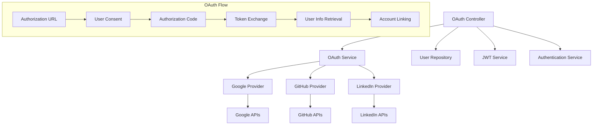
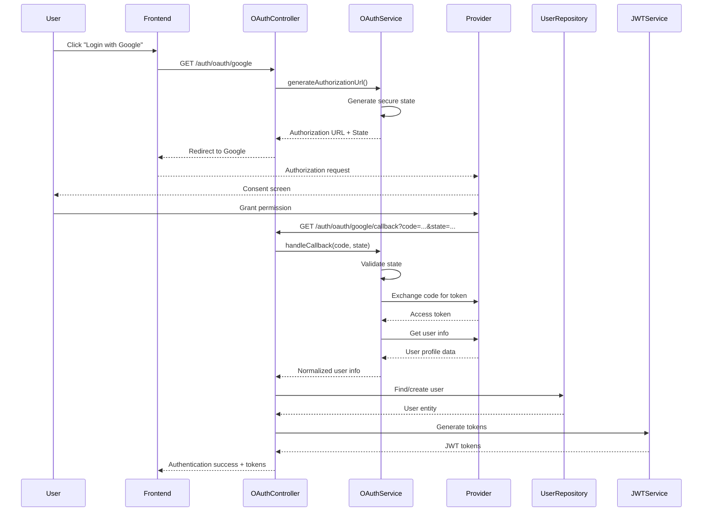

# Sprint 4: OAuth Social Authentication - Design

## Overview

This sprint implements a comprehensive OAuth 2.0 social authentication system that enables users to authenticate using their existing accounts from Google, GitHub, and LinkedIn. The design focuses on creating secure, standards-compliant OAuth flows with intelligent account linking capabilities. The system provides a unified interface for multiple OAuth providers while handling provider-specific requirements and maintaining security throughout the authentication process.

## Architecture

### OAuth Authentication System Architecture

The OAuth system extends the existing authentication architecture with specialized services for social authentication:



### OAuth Authentication Flow



## Components and Interfaces

### OAuth Controller

#### OAuth Controller (`OAuthController`)

**Interface**:

```typescript
interface IOAuthController {
  initiateOAuth(c: Context): Promise<Response>;
  handleOAuthCallback(c: Context): Promise<Response>;
  getEnabledProviders(c: Context): Promise<Response>;
  unlinkOAuthProvider(c: Context): Promise<Response>;
}
```

**Core Responsibilities**:

- **OAuth Initiation**: Generate authorization URLs and redirect users to providers
- **Callback Handling**: Process OAuth callbacks and complete authentication
- **Provider Management**: List enabled providers and handle provider-specific logic
- **Account Unlinking**: Remove social identities with safety checks

**Security Features**:

- **State Validation**: CSRF protection through secure state parameters
- **Provider Verification**: Ensure requested providers are enabled and configured
- **Error Handling**: Comprehensive error handling with user-friendly messages
- **Authentication Integration**: Seamless integration with existing JWT authentication

### OAuth Service System

#### OAuth Service (`OAuthService`)

**Interface**:

```typescript
interface IOAuthService {
  generateAuthorizationUrl(
    provider: OAuthProvider,
    redirectTo?: string,
  ): OAuthAuthorizationURL;
  handleCallback(
    provider: OAuthProvider,
    code: string,
    state: string,
  ): Promise<OAuthUserInfo>;
  validateState(stateString: string): OAuthState;
  isProviderEnabled(provider: OAuthProvider): boolean;
  getEnabledProviders(): OAuthProvider[];
}
```

**State Management**:

```typescript
interface OAuthState {
  provider: OAuthProvider; // Provider identifier
  redirectTo?: string; // Optional redirect URL
  timestamp: number; // State generation timestamp
  nonce: string; // Cryptographic nonce
}
```

**State Generation and Validation**:

```typescript
generateAuthorizationUrl(provider: OAuthProvider, redirectTo?: string): OAuthAuthorizationURL {
  const state: OAuthState = {
    provider,
    redirectTo,
    timestamp: Date.now(),
    nonce: crypto.randomBytes(16).toString('hex')
  }

  const stateString = Buffer.from(JSON.stringify(state)).toString('base64url')
  const url = this.providers.get(provider).getAuthorizationUrl(stateString)

  return { url, state: stateString }
}

validateState(stateString: string): OAuthState {
  const decoded = Buffer.from(stateString, 'base64url').toString('utf-8')
  const stateData = JSON.parse(decoded)
  const validatedState = oauthStateSchema.parse(stateData)

  // Check expiry (10 minutes max)
  const maxAge = 10 * 60 * 1000
  if (Date.now() - validatedState.timestamp > maxAge) {
    throw new Error('State has expired')
  }

  return validatedState
}
```

### OAuth Provider Implementations

#### Provider Interface

```typescript
interface IOAuthProvider {
  getAuthorizationUrl(state: string): string;
  exchangeCodeForToken(code: string): Promise<OAuthTokenResponse>;
  getUserInfo(accessToken: string): Promise<OAuthUserInfo>;
}
```

#### Google OAuth Provider

**Configuration**:

```typescript
class GoogleOAuthProvider implements IOAuthProvider {
  private config = {
    clientId: env.GOOGLE_CLIENT_ID,
    clientSecret: env.GOOGLE_CLIENT_SECRET,
    redirectUri: env.GOOGLE_REDIRECT_URI,
    scope: "openid email profile",
  };
}
```

**Authorization URL Generation**:

```typescript
getAuthorizationUrl(state: string): string {
  const params = new URLSearchParams({
    response_type: 'code',
    client_id: this.config.clientId,
    redirect_uri: this.config.redirectUri,
    scope: this.config.scope,
    state,
    access_type: 'offline',
    prompt: 'consent'
  })

  return `https://accounts.google.com/o/oauth2/v2/auth?${params.toString()}`
}
```

**User Info Retrieval**:

```typescript
async getUserInfo(accessToken: string): Promise<OAuthUserInfo> {
  const response = await fetch('https://openidconnect.googleapis.com/v1/userinfo', {
    headers: { Authorization: `Bearer ${accessToken}` }
  })

  const data = await response.json()

  return {
    id: data.sub,
    email: data.email,
    name: data.name,
    firstName: data.given_name,
    lastName: data.family_name,
    picture: data.picture,
    provider: 'google'
  }
}
```

#### GitHub OAuth Provider

**Unique Requirements**:

- **Email Verification**: GitHub requires separate API call to get verified emails
- **Primary Email Detection**: Must identify primary and verified email from email list
- **Username Handling**: Uses login as fallback for missing display name

**User Info Implementation**:

```typescript
async getUserInfo(accessToken: string): Promise<OAuthUserInfo> {
  const [userResponse, emailsResponse] = await Promise.all([
    fetch('https://api.github.com/user', {
      headers: { Authorization: `Bearer ${accessToken}` }
    }),
    fetch('https://api.github.com/user/emails', {
      headers: { Authorization: `Bearer ${accessToken}` }
    })
  ])

  const userData = await userResponse.json()
  const emailsData = await emailsResponse.json()

  const primaryEmail = emailsData.find(email =>
    email.primary && email.verified
  )

  if (!primaryEmail) {
    throw new Error('No verified primary email found in GitHub account')
  }

  return {
    id: userData.id.toString(),
    email: primaryEmail.email,
    name: userData.name || userData.login,
    firstName: userData.name?.split(' ')[0] || userData.login,
    lastName: userData.name?.split(' ').slice(1).join(' ') || undefined,
    picture: userData.avatar_url,
    provider: 'github'
  }
}
```

#### LinkedIn OAuth Provider

**Configuration**:

```typescript
class LinkedInOAuthProvider implements IOAuthProvider {
  private config = {
    clientId: env.LINKEDIN_CLIENT_ID,
    clientSecret: env.LINKEDIN_CLIENT_SECRET,
    redirectUri: env.LINKEDIN_REDIRECT_URI,
    scope: "openid profile email",
  };
}
```

**API Integration**:

- **OpenID Connect**: Uses LinkedIn's OpenID Connect endpoint for user info
- **Standardized Response**: Provides consistent data format similar to Google
- **Professional Context**: Optimized for professional networking data

## Data Models

### OAuth User Information

```typescript
interface OAuthUserInfo {
  id: string; // Provider-specific user ID
  email: string; // Verified email address
  name: string; // Full display name
  firstName?: string; // First name (optional)
  lastName?: string; // Last name (optional)
  picture?: string; // Profile picture URL (optional)
  provider: OAuthProvider; // Provider identifier
}
```

### Social Identity Model

```typescript
interface SocialIdentityObjectType {
  provider: OAuthProvider; // 'google' | 'github' | 'linkedin'
  providerUserId: string; // Provider-specific user ID
  email?: string; // Email from provider (optional)
  name?: string; // Display name from provider (optional)
  linkedAt: Date; // When identity was linked
}
```

### OAuth Configuration

```typescript
interface OAuthConfig {
  clientId: string; // OAuth client ID
  clientSecret: string; // OAuth client secret
  redirectUri: string; // Callback URL
  scope: string; // Requested permissions
}
```

### OAuth Token Response

```typescript
interface OAuthTokenResponse {
  access_token: string; // Access token for API calls
  token_type: string; // Token type (usually 'Bearer')
  expires_in?: number; // Token expiry in seconds
  refresh_token?: string; // Refresh token (if available)
  scope?: string; // Granted scopes
}
```

## Account Linking Logic

### Intelligent Account Linking

```typescript
async handleOAuthCallback(provider: OAuthProvider, code: string, state: string): Promise<AuthenticationResult> {
  // 1. Validate state and exchange code for user info
  const userInfo = await this.oauthService.handleCallback(provider, code, state)

  // 2. Check for existing user with same email
  let user = await this.userRepository.findByEmail(userInfo.email)

  if (user) {
    // 3a. Link social identity to existing account
    const existingSocialIdentity = user.socialIdentities?.find(
      identity => identity.provider === provider
    )

    if (!existingSocialIdentity) {
      // Link new social identity
      await this.userRepository.linkSocialIdentity(user.id, {
        provider,
        providerUserId: userInfo.id,
        email: userInfo.email,
        name: userInfo.name,
        linkedAt: new Date()
      })
    } else if (existingSocialIdentity.providerUserId !== userInfo.id) {
      // Conflict: same email, different provider user ID
      throw new UserAlreadyExistsError(
        'This email is associated with a different account on this provider'
      )
    }
  } else {
    // 3b. Create new account with social identity
    const userData: CreateUserType = {
      firstName: userInfo.firstName || userInfo.name.split(' ')[0] || '',
      lastName: userInfo.lastName || userInfo.name.split(' ').slice(1).join(' ') || '',
      primaryEmail: userInfo.email,
      emails: [{
        emailAddress: userInfo.email,
        isVerified: true,  // Social provider emails are pre-verified
        addedAt: new Date()
      }],
      globalRole: 'student',
      socialIdentities: [{
        provider,
        providerUserId: userInfo.id,
        email: userInfo.email,
        name: userInfo.name,
        linkedAt: new Date()
      }]
    }

    user = await this.userRepository.create(userData)
  }

  // 4. Generate JWT tokens
  const tokens = await this.jwtService.generateTokenPair(user)

  return { user, accessToken: tokens.accessToken, refreshToken: tokens.refreshToken }
}
```

### Social Account Unlinking

```typescript
async unlinkOAuthProvider(userId: string, provider: OAuthProvider): Promise<void> {
  const user = await this.userRepository.findById(userId)

  // Safety checks
  const hasPassword = !!user.passwordHash
  const socialIdentities = user.socialIdentities || []
  const hasOtherSocialIdentities = socialIdentities.length > 1

  // Prevent unlinking the only authentication method
  if (!hasPassword && !hasOtherSocialIdentities) {
    throw new BadRequestError(
      'Cannot unlink the only authentication method. Set a password first.'
    )
  }

  const socialIdentity = socialIdentities.find(
    identity => identity.provider === provider
  )

  if (!socialIdentity) {
    throw new NotFoundError(`${provider} account is not linked`)
  }

  await this.userRepository.unlinkSocialIdentity(
    userId,
    provider,
    socialIdentity.providerUserId
  )
}
```

## Error Handling

### OAuth-Specific Errors

```typescript
class OAuthProviderError extends BadRequestError {
  constructor(provider: string, message: string) {
    super(`${provider} OAuth error: ${message}`);
  }
}

class OAuthStateError extends BadRequestError {
  constructor(message: string = "Invalid or expired OAuth state") {
    super(message);
  }
}

class OAuthConfigurationError extends InternalServerError {
  constructor(provider: string) {
    super(`OAuth provider '${provider}' is not properly configured`);
  }
}

class AccountLinkingError extends BadRequestError {
  constructor(message: string) {
    super(`Account linking failed: ${message}`);
  }
}
```

### Provider-Specific Error Handling

```typescript
async exchangeCodeForToken(code: string): Promise<OAuthTokenResponse> {
  try {
    const response = await fetch(tokenEndpoint, {
      method: 'POST',
      headers: { 'Content-Type': 'application/x-www-form-urlencoded' },
      body: new URLSearchParams({ /* token exchange params */ })
    })

    if (!response.ok) {
      const errorText = await response.text()
      throw new OAuthProviderError(
        this.providerName,
        `Token exchange failed: ${response.status} ${errorText}`
      )
    }

    return response.json()
  } catch (error) {
    if (error instanceof OAuthProviderError) throw error
    throw new OAuthProviderError(this.providerName, 'Network error during token exchange')
  }
}
```

## Security Considerations

### OAuth Security Measures

**State Parameter Security**:

- **Cryptographic Nonce**: 16-byte random nonce for uniqueness
- **Timestamp Validation**: 10-minute expiry window for state parameters
- **Base64URL Encoding**: Safe URL encoding for state data
- **Provider Matching**: State provider must match callback provider

**Token Security**:

- **Immediate Use**: Access tokens used immediately and not stored
- **Secure Exchange**: HTTPS-only communication with OAuth providers
- **Client Secret Protection**: Server-side token exchange with client secrets
- **Scope Limitation**: Minimal required scopes for each provider

**Account Linking Security**:

- **Email Verification**: Only verified emails used for account linking
- **Provider ID Validation**: Prevent account takeover through provider ID conflicts
- **Authentication Required**: Social account management requires active authentication
- **Audit Logging**: Comprehensive logging of OAuth events and account linking

### CSRF Protection

```typescript
// State generation with CSRF protection
const state: OAuthState = {
  provider,
  redirectTo,
  timestamp: Date.now(),
  nonce: crypto.randomBytes(16).toString('hex')  // CSRF protection
}

// State validation with timing attack protection
validateState(stateString: string): OAuthState {
  const decoded = Buffer.from(stateString, 'base64url').toString('utf-8')
  const stateData = JSON.parse(decoded)

  // Validate structure and expiry
  const validatedState = oauthStateSchema.parse(stateData)
  const maxAge = 10 * 60 * 1000  // 10 minutes

  if (Date.now() - validatedState.timestamp > maxAge) {
    throw new Error('State has expired')
  }

  return validatedState
}
```

## Testing Strategy

### Unit Testing Approach

**OAuth Service Tests**:

- **State Generation**: Secure state parameter creation and validation
- **Provider Integration**: Mock provider responses and error handling
- **Token Exchange**: Authorization code to access token flow
- **User Info Mapping**: Provider-specific data normalization

**OAuth Controller Tests**:

- **Authorization Flow**: URL generation and redirect handling
- **Callback Processing**: Complete OAuth callback workflow
- **Account Linking**: User creation and social identity linking
- **Error Scenarios**: Invalid states, provider errors, and edge cases

**Provider Implementation Tests**:

- **API Integration**: Mock provider API responses
- **Data Mapping**: User info normalization and validation
- **Error Handling**: Provider-specific error scenarios
- **Configuration Validation**: Provider setup and credential validation

### Integration Testing

**Complete OAuth Flows**:

- **End-to-End Authentication**: Full OAuth flow from initiation to token generation
- **Account Linking Scenarios**: New user creation and existing user linking
- **Multiple Provider Support**: Testing all supported OAuth providers
- **Error Recovery**: Network failures, provider errors, and invalid responses

**Security Testing**:

- **State Parameter Validation**: CSRF protection and replay attack prevention
- **Token Security**: Secure token handling and immediate disposal
- **Account Takeover Prevention**: Provider ID conflict detection
- **Authorization Bypass**: Attempt to bypass OAuth validation

### Provider-Specific Testing

**Google OAuth Testing**:

- **OpenID Connect Flow**: Standard OpenID Connect implementation
- **User Info Retrieval**: Google userinfo endpoint integration
- **Scope Handling**: Profile and email scope processing

**GitHub OAuth Testing**:

- **Email Verification**: Primary email detection and verification
- **API Rate Limits**: GitHub API rate limiting handling
- **Username Fallbacks**: Display name and username handling

**LinkedIn OAuth Testing**:

- **Professional Data**: LinkedIn-specific profile information
- **API Version Compatibility**: LinkedIn v2 API integration
- **Scope Permissions**: Professional profile access scopes

## Performance Considerations

### OAuth Flow Optimization

**State Management**:

- **Efficient Encoding**: Base64URL encoding for compact state parameters
- **Memory Management**: Stateless design with no server-side state storage
- **Quick Validation**: Fast state parameter validation and expiry checking
- **Minimal Data**: Only essential data in state parameters

**Provider API Optimization**:

- **Concurrent Requests**: Parallel API calls where possible (GitHub user + emails)
- **Connection Reuse**: HTTP connection pooling for provider API calls
- **Timeout Management**: Appropriate timeouts for external API calls
- **Error Caching**: Temporary caching of provider availability status

**Database Operations**:

- **Efficient Queries**: Optimized user lookup by email and social identity
- **Batch Operations**: Bulk social identity linking where applicable
- **Index Optimization**: Proper indexing for email and social identity queries
- **Connection Pooling**: Efficient database connection management

## Configuration Management

### OAuth Provider Configuration

**Environment Variables**:

```typescript
// Google OAuth
GOOGLE_CLIENT_ID=your_google_client_id
GOOGLE_CLIENT_SECRET=your_google_client_secret
GOOGLE_REDIRECT_URI=https://yourdomain.com/auth/oauth/google/callback

// GitHub OAuth
GITHUB_CLIENT_ID=your_github_client_id
GITHUB_CLIENT_SECRET=your_github_client_secret
GITHUB_REDIRECT_URI=https://yourdomain.com/auth/oauth/github/callback

// LinkedIn OAuth
LINKEDIN_CLIENT_ID=your_linkedin_client_id
LINKEDIN_CLIENT_SECRET=your_linkedin_client_secret
LINKEDIN_REDIRECT_URI=https://yourdomain.com/auth/oauth/linkedin/callback
```

**Dynamic Provider Enabling**:

```typescript
isProviderEnabled(provider: OAuthProvider): boolean {
  switch (provider) {
    case 'google':
      return !!(env.GOOGLE_CLIENT_ID && env.GOOGLE_CLIENT_SECRET && env.GOOGLE_REDIRECT_URI)
    case 'github':
      return !!(env.GITHUB_CLIENT_ID && env.GITHUB_CLIENT_SECRET && env.GITHUB_REDIRECT_URI)
    case 'linkedin':
      return !!(env.LINKEDIN_CLIENT_ID && env.LINKEDIN_CLIENT_SECRET && env.LINKEDIN_REDIRECT_URI)
    default:
      return false
  }
}
```

### Environment-Specific Configuration

**Development Configuration**:

- **Local Redirect URIs**: Support for localhost callback URLs
- **Relaxed Validation**: Extended state expiry for debugging
- **Detailed Logging**: Comprehensive OAuth flow logging
- **Mock Providers**: Optional mock provider implementations for testing

**Production Configuration**:

- **Secure Redirect URIs**: HTTPS-only callback URLs
- **Strict Validation**: Standard security timeouts and validation
- **Minimal Logging**: Security-conscious logging without sensitive data
- **Real Providers**: Production OAuth provider integrations
