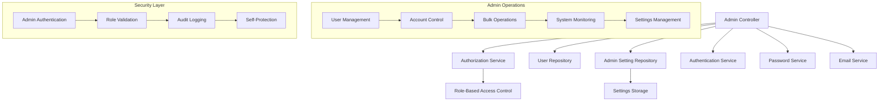
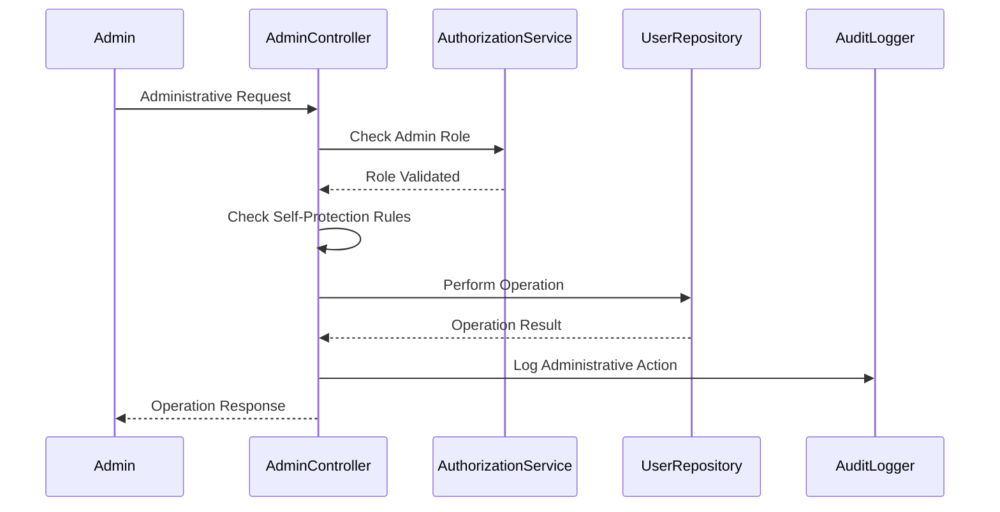

# Sprint 5: Administrative Features - Design

## Overview

This sprint implements a comprehensive administrative system that provides system administrators with complete control over user management, system configuration, and operational monitoring. The design focuses on creating secure, role-based administrative interfaces with robust access controls, comprehensive audit logging, and efficient bulk operations. The administrative system is designed to support production deployment with enterprise-grade management capabilities.

## Architecture

### Administrative System Architecture

The administrative system extends the existing authentication architecture with specialized controllers, services, and repositories for system management:



### Administrative Workflow



## Components and Interfaces

### Admin Controller

#### Admin Controller (`AdminController`)

**Core Interface**:

```typescript
interface IAdminController {
  // User Management
  getAllUsers(c: Context): Promise<Response>;
  getUserById(c: Context): Promise<Response>;
  createUser(c: Context): Promise<Response>;
  updateUser(c: Context): Promise<Response>;
  deleteUser(c: Context): Promise<Response>;
  searchUsers(c: Context): Promise<Response>;

  // Account Control
  lockUser(c: Context): Promise<Response>;
  unlockUser(c: Context): Promise<Response>;
  resetUserPassword(c: Context): Promise<Response>;
  bulkOperations(c: Context): Promise<Response>;

  // System Monitoring
  getSystemStats(c: Context): Promise<Response>;
  getHealthStatus(c: Context): Promise<Response>;

  // Settings Management
  getAllSettings(c: Context): Promise<Response>;
  getSettingByKey(c: Context): Promise<Response>;
  setSettingByKey(c: Context): Promise<Response>;
  deleteSettingByKey(c: Context): Promise<Response>;
  getMultipleSettings(c: Context): Promise<Response>;

  // Password Policy Management
  getPasswordPolicy(c: Context): Promise<Response>;
  validatePasswordPolicy(c: Context): Promise<Response>;
  testPasswordPolicy(c: Context): Promise<Response>;
  getPasswordPolicyInfo(c: Context): Promise<Response>;
}
```

**Security Features**:

- **Role-Based Access Control**: Admin role verification for all endpoints
- **Self-Protection**: Prevention of self-destructive administrative actions
- **Audit Logging**: Comprehensive logging of all administrative operations
- **Input Validation**: Thorough validation of all administrative requests

### Authorization Service

#### Authorization Service (`AuthorizationService`)

**Interface**:

```typescript
interface IAuthorizationService {
  isAdmin(user: AuthenticatedUserContextType): boolean;
  isTeacher(user: AuthenticatedUserContextType): boolean;
  isStudent(user: AuthenticatedUserContextType): boolean;

  canManageUsers(user: AuthenticatedUserContextType): Promise<boolean>;
  canViewUserProfile(
    requestingUser: AuthenticatedUserContextType,
    targetUserId: string,
  ): Promise<boolean>;
  canUpdateUserProfile(
    requestingUser: AuthenticatedUserContextType,
    targetUserId: string,
  ): Promise<boolean>;
  canReceiveAuthEvent(
    user: AuthenticatedUserContextType,
    eventData: any,
  ): Promise<boolean>;
}
```

**Role-Based Permissions**:

```typescript
class AuthorizationService {
  async canManageUsers(user: AuthenticatedUserContextType): Promise<boolean> {
    return this.isAdmin(user);
  }

  async canViewUserProfile(
    requestingUser: AuthenticatedUserContextType,
    targetUserId: string,
  ): Promise<boolean> {
    if (this.isAdmin(requestingUser)) return true;
    if (requestingUser.userId === targetUserId) return true;
    return false;
  }
}
```

### Admin Settings Management

#### Admin Setting Repository (`IAdminSettingRepository`)

**Interface**:

```typescript
interface IAdminSettingRepository {
  create(
    data: Omit<AdminSettingType, "id" | "updatedAt">,
  ): Promise<AdminSettingType>;
  findByKey(key: string): Promise<AdminSettingType | null>;
  findAll(): Promise<AdminSettingType[]>;
  updateByKey(
    key: string,
    data: Partial<AdminSettingType>,
  ): Promise<AdminSettingType>;
  deleteByKey(key: string): Promise<boolean>;
  existsByKey(key: string): Promise<boolean>;
  getValue<T>(key: string, defaultValue?: T): Promise<T>;
  setValue(
    key: string,
    value: unknown,
    description?: string,
  ): Promise<AdminSettingType>;
  getMultiple(keys: string[]): Promise<Map<string, unknown>>;
}
```

**Settings Management Features**:

- **Type-Safe Values**: Generic type support for setting values
- **Default Values**: Fallback values for missing settings
- **Batch Operations**: Efficient retrieval of multiple settings
- **Metadata Support**: Setting descriptions and update timestamps

#### MongoDB Admin Setting Implementation

```typescript
class MongoDbAdminSettingRepository implements IAdminSettingRepository {
  private async getCollection(): Promise<
    Collection<MongoAdminSettingDocument>
  > {
    if (!this.collection) {
      this.db = await getDatabase();
      this.collection = this.db.collection("adminSettings");

      // Create indexes for performance
      await this.collection.createIndex({ key: 1 }, { unique: true });
      await this.collection.createIndex({ updatedAt: 1 });
    }
    return this.collection;
  }

  async setValue(
    key: string,
    value: unknown,
    description?: string,
  ): Promise<AdminSettingType> {
    const existing = await this.findByKey(key);

    if (existing) {
      return await this.updateByKey(key, { value, description });
    } else {
      return await this.create({ key, value, description });
    }
  }
}
```

## Data Models

### Admin Setting Model

```typescript
interface AdminSettingType {
  id: string; // Unique setting identifier
  key: string; // Setting key (unique)
  value: unknown; // Setting value (flexible type)
  description?: string; // Optional setting description
  updatedAt?: Date; // Last update timestamp
}
```

### System Statistics Model

```typescript
interface SystemStats {
  totalUsers: number;
  usersByRole: {
    admin: number;
    teacher: number;
    student: number;
  };
  accountStatus: {
    active: number;
    locked: number;
  };
  emailVerification: {
    fullyVerified: number;
    partiallyVerified: number;
    unverified: number;
  };
  socialLogins: number;
  recentActivity: {
    newUsersLast7Days: number;
    activeUsersLast7Days: number;
  };
}
```

### Health Check Model

```typescript
interface HealthStatus {
  status: "healthy" | "warning" | "critical" | "degraded";
  timestamp: Date;
  version: string;
  uptime: number;
  environment: string;
  checks: {
    database: {
      status: "healthy" | "slow" | "unhealthy";
      responseTime: number;
    };
    memory: {
      status: "healthy" | "warning" | "critical";
      used: number;
      free: number;
    };
    settings: {
      status: "healthy" | "unhealthy";
      count: number;
    };
  };
}
```

### Bulk Operation Result

```typescript
interface BulkOperationResult {
  success: number;
  failed: number;
  errors: string[];
}
```

## User Management Features

### User Creation and Management

```typescript
async createUser(userData: AdminRegisterUserType): Promise<UserCreationResult> {
  // 1. Validate user data and check for duplicates
  const existingUser = await this.userRepository.findByEmail(userData.email)
  if (existingUser) {
    throw new UserAlreadyExistsError('User with this email already exists')
  }

  // 2. Handle password generation or validation
  let passwordHash: string | undefined
  let generatedPassword: string | undefined

  if (userData.generatePassword) {
    generatedPassword = this.passwordService.generateSecurePassword()
    passwordHash = await this.passwordService.hashPassword(generatedPassword)
  } else if (userData.password) {
    const validation = this.passwordService.validatePasswordStrength(userData.password)
    if (!validation.isValid) {
      throw new BadRequestError(`Password validation failed: ${validation.errors.join(', ')}`)
    }
    passwordHash = await this.passwordService.hashPassword(userData.password)
  }

  // 3. Create user with admin privileges
  const newUser = await this.userRepository.create({
    ...userData,
    passwordHash,
    emails: [{
      emailAddress: userData.email,
      isVerified: true,  // Admin-created users have verified emails
      addedAt: new Date()
    }]
  })

  // 4. Optional welcome email
  if (userData.sendWelcomeEmail) {
    await this.emailService.sendWelcomeEmail(userData.email, userData.firstName)
  }

  return { user: newUser, generatedPassword }
}
```

### Account Status Management

```typescript
async lockUser(userId: string, lockUntil?: Date): Promise<void> {
  // Prevent admin from locking themselves
  if (userId === this.currentAdminId) {
    throw new BadRequestError('Cannot lock your own account')
  }

  const user = await this.userRepository.findById(userId)
  if (!user) {
    throw new NotFoundError('User not found')
  }

  if (user.isAccountLocked) {
    throw new BadRequestError('User account is already locked')
  }

  await this.userRepository.updateLoginAttempts(
    user.primaryEmail,
    user.failedLoginAttempts,
    true,
    lockUntil
  )
}

async unlockUser(userId: string): Promise<void> {
  const user = await this.userRepository.findById(userId)
  if (!user || !user.isAccountLocked) {
    throw new BadRequestError('User account is not locked')
  }

  await this.authenticationService.unlockAccount(userId)
}
```

### Bulk Operations

```typescript
async bulkOperations(operation: string, userIds: string[]): Promise<BulkOperationResult> {
  // Prevent admin from including themselves in bulk operations
  if (userIds.includes(this.currentAdminId)) {
    throw new BadRequestError('Cannot perform bulk operations on your own account')
  }

  const results: BulkOperationResult = {
    success: 0,
    failed: 0,
    errors: []
  }

  for (const userId of userIds) {
    try {
      const user = await this.userRepository.findById(userId)
      if (!user) {
        results.failed++
        results.errors.push(`User ${userId} not found`)
        continue
      }

      switch (operation) {
        case 'lock':
          if (!user.isAccountLocked) {
            await this.lockUser(userId)
            results.success++
          } else {
            results.errors.push(`User ${userId} is already locked`)
          }
          break

        case 'unlock':
          if (user.isAccountLocked) {
            await this.unlockUser(userId)
            results.success++
          } else {
            results.errors.push(`User ${userId} is not locked`)
          }
          break

        case 'delete':
          await this.userRepository.delete(userId)
          results.success++
          break

        default:
          results.failed++
          results.errors.push(`Unknown operation: ${operation}`)
      }
    } catch (error) {
      results.failed++
      results.errors.push(`Failed to ${operation} user ${userId}: ${error.message}`)
    }
  }

  return results
}
```

## System Monitoring and Health Checks

### System Statistics Generation

```typescript
async getSystemStats(): Promise<SystemStats> {
  const allUsers = await this.userRepository.findMany({}, 10000)

  return {
    totalUsers: allUsers.length,
    usersByRole: {
      admin: allUsers.filter(u => u.globalRole === 'admin').length,
      teacher: allUsers.filter(u => u.globalRole === 'teacher').length,
      student: allUsers.filter(u => u.globalRole === 'student').length
    },
    accountStatus: {
      active: allUsers.filter(u => !u.isAccountLocked).length,
      locked: allUsers.filter(u => u.isAccountLocked).length
    },
    emailVerification: {
      fullyVerified: allUsers.filter(u => u.emails.every(email => email.isVerified)).length,
      partiallyVerified: allUsers.filter(u =>
        u.emails.some(email => email.isVerified) &&
        !u.emails.every(email => email.isVerified)
      ).length,
      unverified: allUsers.filter(u => !u.emails.some(email => email.isVerified)).length
    },
    socialLogins: allUsers.filter(u => u.socialIdentities.length > 0).length,
    recentActivity: {
      newUsersLast7Days: allUsers.filter(u =>
        u.createdAt && u.createdAt > new Date(Date.now() - 7 * 24 * 60 * 60 * 1000)
      ).length,
      activeUsersLast7Days: allUsers.filter(u =>
        u.lastLoginAt && u.lastLoginAt > new Date(Date.now() - 7 * 24 * 60 * 60 * 1000)
      ).length
    }
  }
}
```

### Health Status Monitoring

```typescript
async getHealthStatus(): Promise<HealthStatus> {
  const healthChecks: HealthStatus = {
    status: 'healthy',
    timestamp: new Date(),
    version: process.env.npm_package_version || 'unknown',
    uptime: process.uptime(),
    environment: env.NODE_ENV,
    checks: {
      database: { status: 'unknown', responseTime: 0 },
      memory: { status: 'unknown', used: 0, free: 0 },
      settings: { status: 'unknown', count: 0 }
    }
  }

  // Database health check
  try {
    const dbStart = Date.now()
    await this.userRepository.findMany({}, 1)
    const dbTime = Date.now() - dbStart

    healthChecks.checks.database = {
      status: dbTime < 1000 ? 'healthy' : 'slow',
      responseTime: dbTime
    }
  } catch (error) {
    healthChecks.checks.database = { status: 'unhealthy', responseTime: 0 }
    healthChecks.status = 'degraded'
  }

  // Memory health check
  const memUsage = process.memoryUsage()
  const totalMem = memUsage.heapTotal
  const usedMem = memUsage.heapUsed
  const memUsagePercent = (usedMem / totalMem) * 100

  healthChecks.checks.memory = {
    status: memUsagePercent > 90 ? 'critical' :
            memUsagePercent > 75 ? 'warning' : 'healthy',
    used: usedMem,
    free: totalMem - usedMem
  }

  // Settings repository health check
  try {
    const settings = await this.adminSettingRepository.findAll()
    healthChecks.checks.settings = { status: 'healthy', count: settings.length }
  } catch (error) {
    healthChecks.checks.settings = { status: 'unhealthy', count: 0 }
    healthChecks.status = 'degraded'
  }

  return healthChecks
}
```

## Password Policy Management

### Password Policy Configuration

```typescript
interface PasswordPolicyType {
  minLength: number;
  maxLength: number;
  requireUppercase: boolean;
  requireLowercase: boolean;
  requireNumbers: boolean;
  requireSpecialChars: boolean;
}

class PasswordService {
  getCurrentPasswordPolicy(): PasswordPolicyType {
    return {
      minLength: env.PASSWORD_MIN_LENGTH,
      maxLength: env.PASSWORD_MAX_LENGTH,
      requireUppercase: env.PASSWORD_REQUIRE_UPPERCASE,
      requireLowercase: env.PASSWORD_REQUIRE_LOWERCASE,
      requireNumbers: env.PASSWORD_REQUIRE_NUMBERS,
      requireSpecialChars: env.PASSWORD_REQUIRE_SPECIAL_CHARS,
    };
  }

  validatePasswordPolicy(policy: PasswordPolicyType): ValidationResult {
    const errors: string[] = [];

    if (policy.minLength < 4 || policy.minLength > 128) {
      errors.push("Minimum length must be between 4 and 128");
    }

    if (policy.maxLength < 8 || policy.maxLength > 256) {
      errors.push("Maximum length must be between 8 and 256");
    }

    if (policy.minLength >= policy.maxLength) {
      errors.push("Minimum length must be less than maximum length");
    }

    return {
      isValid: errors.length === 0,
      errors,
    };
  }

  generateSecurePassword(length?: number): string {
    const policy = this.getCurrentPasswordPolicy();
    const targetLength = length || policy.minLength + 2;

    let charset = "";
    let requiredChars = "";

    if (policy.requireLowercase) {
      charset += "abcdefghijklmnopqrstuvwxyz";
      requiredChars += "a";
    }

    if (policy.requireUppercase) {
      charset += "ABCDEFGHIJKLMNOPQRSTUVWXYZ";
      requiredChars += "A";
    }

    if (policy.requireNumbers) {
      charset += "0123456789";
      requiredChars += "1";
    }

    if (policy.requireSpecialChars) {
      charset += '!@#$%^&*(),.?":{}|<>';
      requiredChars += "!";
    }

    // Generate password ensuring all requirements are met
    let password = requiredChars;
    for (let i = requiredChars.length; i < targetLength; i++) {
      password += charset.charAt(Math.floor(Math.random() * charset.length));
    }

    // Shuffle the password
    return password
      .split("")
      .sort(() => Math.random() - 0.5)
      .join("");
  }
}
```

## Error Handling

### Administrative Error Types

```typescript
class AdminAccessDeniedError extends ForbiddenError {
  constructor(message: string = "Administrative access required") {
    super(message);
  }
}

class SelfModificationError extends BadRequestError {
  constructor(operation: string) {
    super(`Cannot ${operation} your own account`);
  }
}

class BulkOperationError extends BadRequestError {
  constructor(
    message: string,
    public results: BulkOperationResult,
  ) {
    super(message);
  }
}

class SettingValidationError extends BadRequestError {
  constructor(key: string, message: string) {
    super(`Setting '${key}' validation failed: ${message}`);
  }
}
```

### Error Response Format

```typescript
interface AdminErrorResponse {
  error: string;
  code: number;
  details?: {
    operation?: string;
    affectedUsers?: string[];
    bulkResults?: BulkOperationResult;
    settingKey?: string;
  };
  timestamp: string;
  adminContext: {
    adminUserId: string;
    operation: string;
  };
}
```

## Security Considerations

### Administrative Security Measures

**Role-Based Access Control**:

- **Admin Role Verification**: All administrative endpoints require admin role
- **Self-Protection**: Prevention of self-destructive administrative actions
- **Operation Validation**: Comprehensive validation of administrative requests
- **Audit Logging**: Complete audit trail of all administrative operations

**Data Protection**:

- **Sensitive Data Filtering**: Removal of password hashes and tokens from responses
- **Input Sanitization**: Thorough validation and sanitization of all inputs
- **SQL Injection Prevention**: Parameterized queries and input validation
- **XSS Prevention**: Output encoding and content security policies

**Session Security**:

- **Admin Session Management**: Same security standards as regular user sessions
- **Token Validation**: JWT token verification for all administrative requests
- **Session Timeout**: Appropriate session timeouts for administrative access
- **Multi-Factor Authentication**: Support for enhanced admin authentication

### Audit Logging

```typescript
interface AdminAuditLog {
  timestamp: Date;
  adminUserId: string;
  adminEmail: string;
  operation: string;
  targetUserId?: string;
  targetEmail?: string;
  operationDetails: Record<string, unknown>;
  result: "success" | "failure";
  errorMessage?: string;
  ipAddress?: string;
  userAgent?: string;
}

class AdminAuditLogger {
  async logAdminOperation(
    admin: AuthenticatedUserContextType,
    operation: string,
    details: Record<string, unknown>,
    result: "success" | "failure",
    error?: Error,
  ): Promise<void> {
    const auditEntry: AdminAuditLog = {
      timestamp: new Date(),
      adminUserId: admin.userId,
      adminEmail: admin.primaryEmail,
      operation,
      operationDetails: details,
      result,
      errorMessage: error?.message,
      // Additional context would be extracted from request
    };

    // Store audit log (implementation depends on logging system)
    await this.storeAuditLog(auditEntry);
  }
}
```

## Testing Strategy

### Unit Testing Approach

**Admin Controller Tests**:

- **Role Verification**: Admin role requirement testing
- **Self-Protection**: Prevention of self-destructive actions
- **User Management**: CRUD operations with validation
- **Bulk Operations**: Multi-user operation testing
- **Error Handling**: Comprehensive error scenario coverage

**Authorization Service Tests**:

- **Role-Based Access**: Permission checking for different roles
- **User Context Validation**: User identity and permission verification
- **Edge Cases**: Invalid users, missing roles, and permission conflicts

**Settings Repository Tests**:

- **CRUD Operations**: Create, read, update, delete operations
- **Type Safety**: Generic type handling and validation
- **Batch Operations**: Multiple setting retrieval and updates
- **Error Scenarios**: Missing settings, invalid values, and database errors

### Integration Testing

**Administrative Workflows**:

- **Complete Admin Operations**: End-to-end administrative task completion
- **User Lifecycle Management**: User creation, modification, and deletion
- **System Monitoring**: Health checks and statistics generation
- **Settings Management**: Configuration updates and validation

**Security Testing**:

- **Access Control**: Unauthorized access prevention
- **Self-Protection**: Admin self-modification prevention
- **Audit Logging**: Comprehensive operation logging
- **Data Sanitization**: Sensitive data removal from responses

### Performance Testing

**Bulk Operations**:

- **Large User Sets**: Performance with thousands of users
- **Concurrent Operations**: Multiple admin operations simultaneously
- **Memory Usage**: Resource consumption during bulk operations
- **Database Performance**: Query optimization and connection pooling

## Performance Considerations

### Administrative Performance Optimization

**Database Optimization**:

- **Indexed Queries**: Proper indexing for user searches and filtering
- **Pagination**: Efficient pagination for large user lists
- **Query Optimization**: Optimized queries for statistics and health checks
- **Connection Pooling**: Efficient database connection management

**Memory Management**:

- **Bulk Operation Batching**: Processing large operations in batches
- **Result Set Limiting**: Reasonable limits on query results
- **Memory Monitoring**: Health checks include memory usage monitoring
- **Garbage Collection**: Proper cleanup of temporary objects

**Caching Strategy**:

- **Statistics Caching**: Temporary caching of system statistics
- **Settings Caching**: In-memory caching of frequently accessed settings
- **Health Check Caching**: Brief caching of health check results
- **User Data Caching**: Temporary caching of user data for bulk operations
