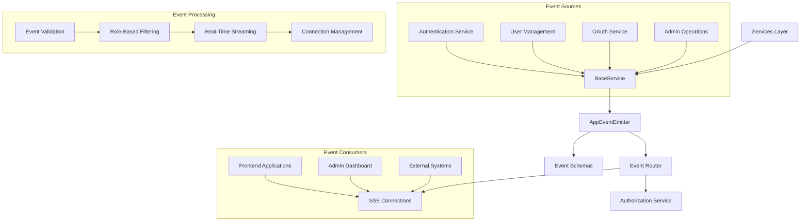
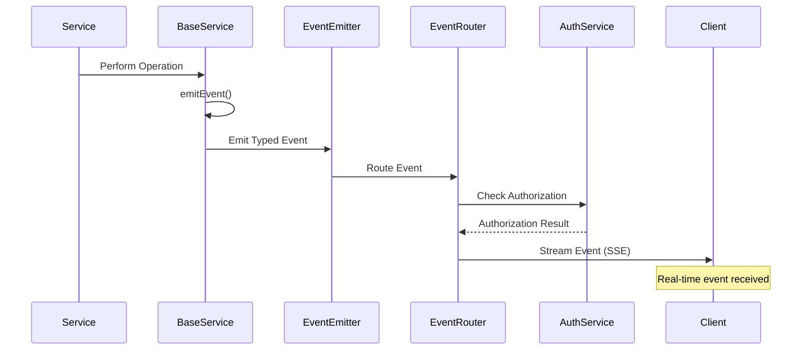

# Sprint 6: Events & Monitoring - Design

## Overview

This sprint implements a comprehensive event-driven architecture with real-time monitoring capabilities that enable applications and administrators to observe authentication activities, user actions, and system events as they occur. The design focuses on creating a scalable, secure, and type-safe event system using Server-Sent Events (SSE) for real-time streaming, with role-based filtering and comprehensive event coverage across all authentication operations.

## Architecture

### Event-Driven System Architecture

The event system creates a centralized event hub that captures all authentication and user management activities:



### Event Flow Architecture



## Components and Interfaces

### Base Service Event System

#### Base Service (`BaseService`)

**Core Interface**:

```typescript
abstract class BaseService {
  constructor(protected serviceName: string)

  protected emitEvent<T>(
    action: ServiceEventType['action'],
    data: T,
    options?: {
      id?: string
      user?: { userId: string; [key: string]: unknown }
    }
  ): void
}
```

**Event Emission Pattern**:

```typescript
class AuthenticationService extends BaseService {
  constructor() {
    super("authentication");
  }

  async login(
    credentials: LoginCredentialsType,
  ): Promise<AuthenticationResult> {
    // ... authentication logic

    // Emit login event
    this.emitEvent(
      "login",
      {
        userId: user.id,
        email: user.primaryEmail,
        sessionId: `jwt-${uuidv4()}`,
        tokenType: "access",
      },
      {
        user: { userId: user.id, email: user.primaryEmail },
      },
    );

    return result;
  }
}
```

### Event Emitter System

#### App Event Emitter (`AppEventEmitter`)

**Interface**:

```typescript
class AppEventEmitter extends EventEmitter {
  emitServiceEvent(serviceName: string, event: ServiceEventType): void;
}

const appEvents = new AppEventEmitter();
```

**Event Routing**:

```typescript
class AppEventEmitter extends EventEmitter {
  emitServiceEvent(serviceName: string, event: ServiceEventType) {
    // Route event with service and action context
    this.emit(`${serviceName}:${event.action}`, event);
  }
}
```

### Event Schema System

#### Event Type Definitions

**Base Event Schema**:

```typescript
interface ServiceEventType {
  id: string; // Unique event identifier
  action: EventAction; // Event action type
  data: unknown; // Event-specific data
  user?: {
    // Optional user context
    id: string;
    [key: string]: unknown;
  };
  timestamp: Date; // Event timestamp
  resourceType: string; // Resource type (service name)
}
```

**Event Action Types**:

```typescript
type EventAction =
  // User lifecycle events
  | "registered"
  | "updated"
  | "deleted"
  // Authentication events
  | "login"
  | "logout"
  | "token_refreshed"
  // Email events
  | "email_verified"
  | "email_added"
  | "email_removed"
  | "verification_sent"
  // Password events
  | "password_changed"
  | "password_reset_requested"
  | "password_reset_completed"
  // OAuth events
  | "oauth_login"
  | "oauth_account_linked"
  | "oauth_account_unlinked"
  // Security events
  | "account_locked"
  | "account_unlocked"
  | "failed_login_attempt"
  // Admin events
  | "user_role_changed"
  | "admin_action_performed";
```

#### Specialized Event Schemas

**Authentication Events**:

```typescript
interface AuthEventType extends ServiceEventType {
  resourceType: "authentication";
  data: {
    userId: string;
    email?: string;
    ipAddress?: string;
    userAgent?: string;
    sessionId?: string;
    tokenType?: "access" | "refresh";
  };
}
```

**User Management Events**:

```typescript
interface UserEventType extends ServiceEventType {
  resourceType: "users";
  data: {
    userId: string;
    email?: string;
    globalRole?: "admin" | "teacher" | "student";
    firstName?: string;
    lastName?: string;
  };
}
```

**Security Events**:

```typescript
interface SecurityEventType extends ServiceEventType {
  resourceType: "security";
  data: {
    userId: string;
    email?: string;
    ipAddress?: string;
    userAgent?: string;
    lockoutDuration?: number;
    failedAttempts?: number;
    reason?: string;
  };
}
```

### Server-Sent Events Implementation

#### Events Router (`EventsRouter`)

**SSE Connection Management**:

```typescript
interface SSEController extends ReadableStreamDefaultController<Uint8Array> {
  cleanup?: () => void;
}

function createEventsRoutes() {
  const router = new Hono<AppEnv>();

  router.get("/", authMiddleware, async (c) => {
    const currentUser = c.var.user;
    const authorizationService = new AuthorizationService();

    const readable = new ReadableStream({
      start(controller: SSEController) {
        // Send connection confirmation
        controller.enqueue(
          new TextEncoder().encode(
            `data: {"type":"connected","message":"Authentication events stream ready"}\n\n`,
          ),
        );

        // Set up event handlers
        const eventHandler = async (event: ServiceEventType) => {
          const canReceive = await shouldUserReceiveEvent(
            event,
            currentUser,
            authorizationService,
          );
          if (canReceive) {
            const eventData = `event: ${event.resourceType}:${event.action}\ndata: ${JSON.stringify(event)}\n\n`;
            controller.enqueue(new TextEncoder().encode(eventData));
          }
        };

        // Register for all event types
        const eventTypes = [
          "users:registered",
          "users:updated",
          "users:deleted",
          "authentication:login",
          "authentication:logout",
          "authentication:token_refreshed",
          "email:email_verified",
          "email:email_added",
          "email:email_removed",
          "oauth:oauth_login",
          "oauth:oauth_account_linked",
          "security:account_locked",
          "security:failed_login_attempt",
          "admin:user_role_changed",
          "admin:admin_action_performed",
        ];

        eventTypes.forEach((eventType) => {
          appEvents.on(eventType, eventHandler);
        });

        // Heartbeat to keep connection alive
        const keepAlive = setInterval(() => {
          controller.enqueue(new TextEncoder().encode(": heartbeat\n\n"));
        }, 30000);

        // Cleanup function
        controller.cleanup = () => {
          eventTypes.forEach((eventType) => {
            appEvents.off(eventType, eventHandler);
          });
          clearInterval(keepAlive);
        };
      },

      cancel(controller: SSEController) {
        if (controller.cleanup) {
          controller.cleanup();
        }
      },
    });

    return new Response(readable, {
      headers: {
        "Content-Type": "text/event-stream",
        "Cache-Control": "no-cache",
        Connection: "keep-alive",
        "Access-Control-Allow-Origin": "*",
        "Access-Control-Allow-Headers": "Authorization",
      },
    });
  });

  return router;
}
```

### Role-Based Event Authorization

#### Event Authorization Logic

```typescript
async function shouldUserReceiveEvent(
  event: ServiceEventType,
  user: AuthenticatedUserContextType,
  authorizationService: AuthorizationService,
): Promise<boolean> {
  switch (event.resourceType) {
    case "users":
    case "authentication":
    case "email":
    case "password":
    case "oauth":
    case "security":
      // Users can see their own events, admins can see all
      if (
        typeof event.data === "object" &&
        event.data !== null &&
        "userId" in event.data
      ) {
        return await authorizationService.canReceiveAuthEvent(
          user,
          event.data as { userId: string; [key: string]: unknown },
        );
      }
      return false;

    case "admin":
      // Admin events are only visible to admins or affected users
      if (authorizationService.isAdmin(user)) {
        return true;
      }

      // Users can see admin events that affect them
      if (
        typeof event.data === "object" &&
        event.data !== null &&
        "targetUserId" in event.data
      ) {
        return event.data.targetUserId === user.userId;
      }
      return false;

    default:
      return false;
  }
}
```

#### Authorization Service Integration

```typescript
class AuthorizationService {
  async canReceiveAuthEvent(
    user: AuthenticatedUserContextType,
    eventData: { userId: string; [key: string]: unknown },
  ): Promise<boolean> {
    // Admins can see all authentication events
    if (this.isAdmin(user)) return true;

    // Users can see their own events
    if (eventData.userId === user.userId) return true;

    return false;
  }
}
```

## Event Coverage and Implementation

### Authentication Service Events

```typescript
class AuthenticationService extends BaseService {
  async register(data: RegisterUserType): Promise<RegistrationResult> {
    // ... registration logic

    this.emitEvent(
      "registered",
      {
        userId: user.id,
        email: user.primaryEmail,
        globalRole: user.globalRole,
        firstName: user.firstName,
        lastName: user.lastName,
      },
      {
        user: { userId: user.id, email: user.primaryEmail },
      },
    );
  }

  async loginWithPassword(
    credentials: LoginCredentialsType,
  ): Promise<AuthenticationResult> {
    // ... login logic

    this.emitEvent(
      "login",
      {
        userId: user.id,
        email: user.primaryEmail,
        sessionId: accessToken ? `jwt-${uuidv4()}` : undefined,
        tokenType: "access",
      },
      {
        user: { userId: user.id, email: user.primaryEmail },
      },
    );
  }

  async refreshTokens(refreshToken: string): Promise<TokenRefreshResult> {
    // ... token refresh logic

    this.emitEvent(
      "token_refreshed",
      {
        userId: user.id,
        email: user.primaryEmail,
        tokenType: "refresh",
      },
      {
        user: { userId: user.id, email: user.primaryEmail },
      },
    );
  }
}
```

### Email Verification Service Events

```typescript
class EmailVerificationService extends BaseService {
  async verifyEmailToken(token: string): Promise<EmailVerificationResult> {
    // ... verification logic

    this.emitEvent(
      "email_verified",
      {
        userId: user.id,
        email: emailObj.emailAddress,
        isVerified: true,
        isPrimary: emailObj.emailAddress === user.primaryEmail,
      },
      {
        user: { userId: user.id, email: user.primaryEmail },
      },
    );
  }

  async generateVerificationToken(
    userId: string,
    emailAddress: string,
  ): Promise<EmailVerificationTokenResult> {
    // ... token generation logic

    this.emitEvent(
      "verification_sent",
      {
        userId,
        email: emailAddress,
        isVerified: false,
      },
      {
        user: { userId, email: emailAddress },
      },
    );
  }
}
```

### OAuth Service Events

```typescript
class OAuthService extends BaseService {
  emitOAuthLogin(userInfo: OAuthUserInfo, userId: string, isNewUser: boolean) {
    this.emitEvent(
      "oauth_login",
      {
        userId,
        provider: userInfo.provider,
        providerUserId: userInfo.id,
        email: userInfo.email,
        isNewUser,
      },
      {
        user: { userId, email: userInfo.email },
      },
    );
  }

  emitAccountLinked(userInfo: OAuthUserInfo, userId: string) {
    this.emitEvent(
      "oauth_account_linked",
      {
        userId,
        provider: userInfo.provider,
        providerUserId: userInfo.id,
        email: userInfo.email,
      },
      {
        user: { userId, email: userInfo.email },
      },
    );
  }
}
```

### Security Events

```typescript
class AuthenticationService extends BaseService {
  private async handleFailedLogin(
    user: UserType,
    config: AuthServiceConfig,
  ): Promise<void> {
    // ... lockout logic

    if (shouldLockAccount) {
      this.emitEvent(
        "account_locked",
        {
          userId: user.id,
          email: user.primaryEmail,
          lockoutDuration,
          failedAttempts: newAttempts,
          reason: "Too many failed login attempts",
        },
        {
          user: { userId: user.id, email: user.primaryEmail },
        },
      );
    } else {
      this.emitEvent(
        "failed_login_attempt",
        {
          userId: user.id,
          email: user.primaryEmail,
          failedAttempts: newAttempts,
        },
        {
          user: { userId: user.id, email: user.primaryEmail },
        },
      );
    }
  }
}
```

## Data Models

### Event Data Structures

**Base Service Event**:

```typescript
interface ServiceEventType {
  id: string; // UUID for event tracking
  action: EventAction; // Standardized action type
  data: unknown; // Event-specific payload
  user?: {
    // User context
    id: string;
    [key: string]: unknown;
  };
  timestamp: Date; // Event occurrence time
  resourceType: string; // Service/resource identifier
}
```

**SSE Message Format**:

```typescript
interface SSEMessage {
  event: string; // Event type (resourceType:action)
  data: string; // JSON-encoded event data
  id?: string; // Optional event ID
  retry?: number; // Retry interval for reconnection
}
```

**Connection State**:

```typescript
interface SSEConnection {
  userId: string; // Connected user ID
  userRole: string; // User role for filtering
  connectionId: string; // Unique connection identifier
  connectedAt: Date; // Connection timestamp
  lastHeartbeat: Date; // Last heartbeat timestamp
  eventHandlers: Map<string, Function>; // Registered event handlers
}
```

## Security Considerations

### Event Data Security

**Data Sanitization**:

```typescript
function sanitizeEventData(
  event: ServiceEventType,
  userRole: string,
): ServiceEventType {
  const sanitizedEvent = { ...event };

  // Remove sensitive data for non-admin users
  if (userRole !== "admin") {
    if (sanitizedEvent.data && typeof sanitizedEvent.data === "object") {
      const data = sanitizedEvent.data as Record<string, unknown>;

      // Remove sensitive fields
      delete data.ipAddress;
      delete data.userAgent;
      delete data.sessionId;
      delete data.resetToken;
    }
  }

  return sanitizedEvent;
}
```

**Connection Security**:

- **Authentication Required**: All SSE connections require valid JWT tokens
- **CORS Configuration**: Proper CORS headers for cross-origin event streaming
- **Rate Limiting**: Connection rate limiting to prevent abuse
- **Resource Cleanup**: Automatic cleanup of disconnected event listeners

### Authorization Controls

**Event Visibility Rules**:

1. **Own Events**: Users can see events related to their own account
2. **Admin Events**: Administrators can see all events across the system
3. **Sensitive Data**: IP addresses, user agents, and tokens filtered for non-admins
4. **Admin Operations**: Administrative events visible only to admins and affected users

## Performance Considerations

### Event System Optimization

**Memory Management**:

```typescript
class EventConnectionManager {
  private connections = new Map<string, SSEConnection>();
  private readonly maxConnections = 1000;
  private readonly heartbeatInterval = 30000;

  addConnection(userId: string, controller: SSEController): void {
    // Limit concurrent connections per user
    const userConnections = Array.from(this.connections.values()).filter(
      (conn) => conn.userId === userId,
    );

    if (userConnections.length >= 5) {
      // Close oldest connection
      const oldest = userConnections.sort(
        (a, b) => a.connectedAt.getTime() - b.connectedAt.getTime(),
      )[0];
      this.removeConnection(oldest.connectionId);
    }

    // Add new connection
    this.connections.set(connectionId, {
      userId,
      connectionId,
      connectedAt: new Date(),
      lastHeartbeat: new Date(),
      controller,
    });
  }

  cleanup(): void {
    // Remove stale connections
    const now = Date.now();
    for (const [id, conn] of this.connections) {
      if (now - conn.lastHeartbeat.getTime() > this.heartbeatInterval * 3) {
        this.removeConnection(id);
      }
    }
  }
}
```

**Event Processing Optimization**:

- **Async Event Handling**: Non-blocking event processing
- **Event Batching**: Batch similar events to reduce processing overhead
- **Connection Pooling**: Efficient management of multiple SSE connections
- **Memory Leak Prevention**: Proper cleanup of event listeners and connections

### Scalability Considerations

**Horizontal Scaling**:

- **Event Distribution**: Events can be distributed across multiple server instances
- **Connection Load Balancing**: SSE connections distributed across servers
- **Event Persistence**: Optional event storage for replay and audit purposes
- **Resource Monitoring**: Connection count and memory usage monitoring

## Testing Strategy

### Unit Testing Approach

**Event Emission Tests**:

```typescript
describe("BaseService Event Emission", () => {
  it("should emit events with proper structure", () => {
    const service = new TestService("test");
    const eventSpy = jest.spyOn(appEvents, "emitServiceEvent");

    service.testEmitEvent("test_action", { userId: "123" });

    expect(eventSpy).toHaveBeenCalledWith(
      "test",
      expect.objectContaining({
        action: "test_action",
        data: { userId: "123" },
        resourceType: "test",
        timestamp: expect.any(Date),
      }),
    );
  });
});
```

**SSE Connection Tests**:

```typescript
describe("SSE Event Streaming", () => {
  it("should stream events to authorized users", async () => {
    const mockUser = { userId: "123", globalRole: "student" };
    const response = await request(app)
      .get("/events")
      .set("Authorization", `Bearer ${validToken}`)
      .expect(200)
      .expect("Content-Type", "text/event-stream");

    // Verify SSE headers and connection
    expect(response.headers["cache-control"]).toBe("no-cache");
    expect(response.headers["connection"]).toBe("keep-alive");
  });
});
```

### Integration Testing

**End-to-End Event Flow**:

```typescript
describe("Event Flow Integration", () => {
  it("should emit and stream login events", async () => {
    // Set up SSE connection
    const eventStream = new EventSource("/events", {
      headers: { Authorization: `Bearer ${userToken}` },
    });

    const eventPromise = new Promise((resolve) => {
      eventStream.onmessage = (event) => {
        const data = JSON.parse(event.data);
        if (data.action === "login") {
          resolve(data);
        }
      };
    });

    // Trigger login
    await request(app)
      .post("/auth/login")
      .send({ email: "test@example.com", password: "password" });

    // Verify event received
    const loginEvent = await eventPromise;
    expect(loginEvent).toMatchObject({
      action: "login",
      resourceType: "authentication",
      data: expect.objectContaining({
        userId: expect.any(String),
        email: "test@example.com",
      }),
    });
  });
});
```

### Performance Testing

**Connection Load Testing**:

- **Concurrent Connections**: Test with hundreds of simultaneous SSE connections
- **Event Throughput**: Measure event processing and streaming performance
- **Memory Usage**: Monitor memory consumption with multiple connections
- **Connection Stability**: Test connection reliability over extended periods

## Event System Extensions

### Future Extensibility

**Custom Event Types**:

```typescript
// Framework for adding new event types
interface CustomEventSchema extends ServiceEventType {
  resourceType: "custom";
  data: {
    customField: string;
    additionalData: unknown;
  };
}

// Registration mechanism for new event types
class EventRegistry {
  static registerEventType(resourceType: string, schema: ZodSchema) {
    // Register new event type with validation
  }
}
```

**External Integration**:

```typescript
// Webhook integration for external systems
class WebhookEventHandler {
  async handleEvent(event: ServiceEventType): Promise<void> {
    // Send events to external webhooks
    await this.sendWebhook(event);
  }
}

// Event persistence for audit and replay
class EventStore {
  async storeEvent(event: ServiceEventType): Promise<void> {
    // Store events for audit trail and replay
  }

  async getEventHistory(
    userId: string,
    limit: number,
  ): Promise<ServiceEventType[]> {
    // Retrieve event history for user
  }
}
```
