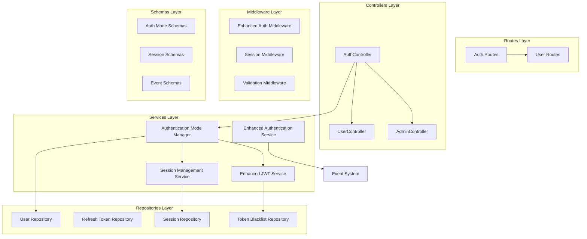
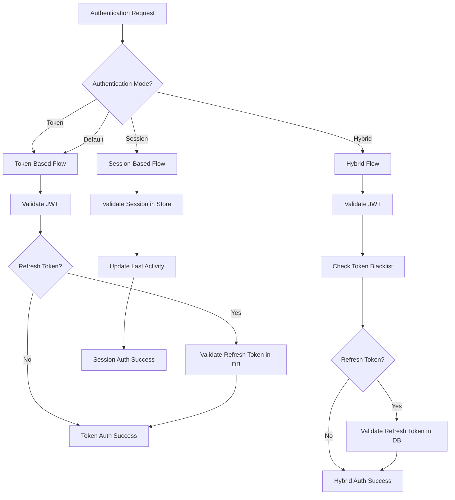

# Sprint 7: Multi-Mode Authentication - Design

## Overview

This design document outlines the implementation of a multi-mode authentication system that supports token-based, session-based, and hybrid authentication modes. The design builds upon the existing robust 6-layer architecture, comprehensive security middleware, and event-driven system established in previous sprints. The implementation extends the current AuthenticationService, JWTService, and repository patterns while adding session management and token blacklisting capabilities to provide immediate logout functionality and enhanced security controls without disrupting the existing authentication infrastructure.

## Architecture

### Enhanced 6-Layer Architecture Integration



### Authentication Flow Decision Tree



## Components and Interfaces

### 1. Authentication Mode Manager

Central component that extends the existing AuthenticationService to route authentication requests to the appropriate mode handler while maintaining backward compatibility.

```typescript
interface IAuthenticationModeManager {
  authenticate(request: AuthRequest, mode: AuthMode): Promise<AuthResult>;
  login(
    credentials: LoginCredentialsType,
    mode: AuthMode,
    config?: Partial<AuthServiceConfig>,
  ): Promise<AuthenticationResult>;
  logout(request: LogoutRequest, mode: AuthMode): Promise<void>;
  refresh(refreshToken: string, mode: AuthMode): Promise<TokenRefreshResult>;
  validateToken(token: string, mode: AuthMode): Promise<JWTPayloadType>;

  // Integration with existing services
  getUserFromToken(token: string, mode: AuthMode): Promise<UserType>;
  changePassword(
    userId: string,
    currentPassword: string,
    newPassword: string,
    mode: AuthMode,
  ): Promise<void>;
}

enum AuthMode {
  TOKEN = "token",
  SESSION = "session",
  HYBRID = "hybrid",
}

interface AuthRequest {
  token?: string;
  sessionId?: string;
  mode?: AuthMode;
  userAgent?: string;
  ipAddress?: string;
}
```

### 2. Session Management System

New repository following the existing repository pattern established in the system architecture.

```typescript
interface ISessionRepository {
  create(session: CreateSessionType): Promise<SessionType>;
  findById(sessionId: string): Promise<SessionType | null>;
  findByUserId(userId: string): Promise<SessionType[]>;
  update(
    sessionId: string,
    updates: Partial<SessionType>,
  ): Promise<SessionType>;
  delete(sessionId: string): Promise<void>;
  deleteAllForUser(userId: string): Promise<void>;
  cleanup(): Promise<void>; // Remove expired sessions

  // Following existing repository patterns
  findMany(
    filter: Partial<SessionType>,
    limit?: number,
  ): Promise<SessionType[]>;
  isSessionCurrentlyActive(sessionId: string): Promise<boolean>;
  updateLastActivity(sessionId: string): Promise<void>;
}

// MongoDB implementation following existing patterns
class MongoDbSessionRepository implements ISessionRepository {
  private async getCollection(): Promise<Collection<MongoSessionDocument>> {
    // Similar to existing MongoDbUserRepository pattern
  }

  private documentToEntity(doc: MongoSessionDocument): SessionType {
    // Similar to existing document mapping patterns
  }
}

interface SessionType {
  id: string;
  userId: string;
  token: string; // Session token (different from JWT)
  expiresAt: Date;
  lastActivityAt: Date;
  createdAt: Date;
  userAgent?: string;
  ipAddress?: string;
  deviceInfo?: DeviceInfo;
  isActive: boolean;
}

interface DeviceInfo {
  browser?: string;
  os?: string;
  device?: string;
  location?: string;
}
```

### 3. Token Blacklist System

Repository for immediate token revocation following the existing repository interface patterns.

```typescript
interface ITokenBlacklistRepository {
  create(blacklistEntry: CreateTokenBlacklistType): Promise<TokenBlacklistType>;
  addToken(
    tokenId: string,
    userId: string,
    expiresAt: Date,
    reason?: string,
  ): Promise<void>;
  isTokenBlacklisted(tokenId: string): Promise<boolean>;
  removeExpiredTokens(): Promise<void>;
  blacklistAllUserTokens(userId: string): Promise<void>;
  getBlacklistedTokens(userId?: string): Promise<TokenBlacklistType[]>;

  // Following existing repository patterns
  findById(id: string): Promise<TokenBlacklistType | null>;
  findByTokenId(tokenId: string): Promise<TokenBlacklistType | null>;
  delete(id: string): Promise<void>;
}

// MongoDB implementation with TTL indexing
class MongoDbTokenBlacklistRepository implements ITokenBlacklistRepository {
  private async getCollection(): Promise<
    Collection<MongoTokenBlacklistDocument>
  > {
    if (!this.collection) {
      this.db = await getDatabase();
      this.collection = this.db.collection("tokenBlacklist");

      // Create TTL index for automatic cleanup
      await this.collection.createIndex(
        { expiresAt: 1 },
        { expireAfterSeconds: 0 },
      );
      await this.collection.createIndex({ tokenId: 1 }, { unique: true });
      await this.collection.createIndex({ userId: 1 });
    }
    return this.collection;
  }
}

interface BlacklistedToken {
  id: string;
  tokenId: string; // JWT 'jti' claim
  userId: string;
  blacklistedAt: Date;
  expiresAt: Date;
  reason?: string;
}
```

### 4. Enhanced JWT Service

Extended JWT service with token ID support for blacklisting.

```typescript
interface IJWTServiceEnhanced extends IJWTService {
  generateAccessTokenWithId(user: UserType, tokenId?: string): Promise<string>;
  extractTokenId(token: string): string | null;
  generateTokenPairWithIds(user: UserType): Promise<TokenPairWithIds>;
}

interface TokenPairWithIds {
  accessToken: string;
  refreshToken: string;
  accessTokenId: string;
  refreshTokenId: string;
}
```

### 5. Authentication Service Enhancement

Enhanced authentication service supporting multiple modes.

```typescript
interface IAuthenticationServiceEnhanced extends IAuthenticationService {
  // Mode-specific methods
  loginWithMode(
    credentials: LoginCredentialsType,
    mode: AuthMode,
  ): Promise<AuthenticationResult>;
  logoutWithMode(request: LogoutRequest, mode: AuthMode): Promise<void>;
  validateWithMode(
    request: AuthRequest,
    mode: AuthMode,
  ): Promise<ValidationResult>;

  // Session management
  getUserSessions(userId: string): Promise<SessionType[]>;
  revokeSession(sessionId: string): Promise<void>;
  revokeAllUserSessions(userId: string, exceptCurrent?: string): Promise<void>;

  // Token management
  blacklistToken(tokenId: string, reason?: string): Promise<void>;
  blacklistAllUserTokens(userId: string): Promise<void>;
}
```

## Data Models

### Session Schema

```typescript
export const sessionSchema = z.object({
  id: z.string(),
  userId: z.string(),
  token: z.string(),
  expiresAt: z.date(),
  lastActivityAt: z.date(),
  createdAt: z.date(),
  updatedAt: z.date(),
  userAgent: z.string().optional(),
  ipAddress: z.string().optional(),
  deviceInfo: z
    .object({
      browser: z.string().optional(),
      os: z.string().optional(),
      device: z.string().optional(),
      location: z.string().optional(),
    })
    .optional(),
  isActive: z.boolean().default(true),
});

export type SessionType = z.infer<typeof sessionSchema>;
```

### Token Blacklist Schema

```typescript
export const tokenBlacklistSchema = z.object({
  id: z.string(),
  tokenId: z.string(), // JWT 'jti' claim
  userId: z.string(),
  blacklistedAt: z.date(),
  expiresAt: z.date(),
  reason: z.string().optional(),
  createdAt: z.date(),
});

export type TokenBlacklistType = z.infer<typeof tokenBlacklistSchema>;
```

### Enhanced Authentication Configuration

```typescript
export const authModeConfigSchema = z.object({
  mode: z.enum(["token", "session", "hybrid"]).default("token"),
  tokenConfig: z
    .object({
      accessTokenExpiryMinutes: z.number().default(15),
      refreshTokenExpiryDays: z.number().default(7),
      enableTokenRotation: z.boolean().default(true),
    })
    .optional(),
  sessionConfig: z
    .object({
      sessionExpiryHours: z.number().default(24),
      extendOnActivity: z.boolean().default(true),
      maxSessionsPerUser: z.number().default(10),
    })
    .optional(),
  hybridConfig: z
    .object({
      enableImmediateRevocation: z.boolean().default(true),
      blacklistCleanupIntervalMinutes: z.number().default(60),
      maxBlacklistSize: z.number().default(10000),
    })
    .optional(),
});

export type AuthModeConfigType = z.infer<typeof authModeConfigSchema>;
```

## Error Handling

### Mode-Specific Error Types

```typescript
export class SessionExpiredError extends Error {
  constructor(message = "Session has expired") {
    super(message);
    this.name = "SessionExpiredError";
  }
}

export class TokenBlacklistedError extends Error {
  constructor(message = "Token has been revoked") {
    super(message);
    this.name = "TokenBlacklistedError";
  }
}

export class InvalidAuthModeError extends Error {
  constructor(mode: string) {
    super(`Invalid authentication mode: ${mode}`);
    this.name = "InvalidAuthModeError";
  }
}

export class SessionLimitExceededError extends Error {
  constructor(message = "Maximum number of sessions exceeded") {
    super(message);
    this.name = "SessionLimitExceededError";
  }
}
```

### Error Handling Strategy

```typescript
class AuthenticationModeManager {
  async authenticate(
    request: AuthRequest,
    mode: AuthMode,
  ): Promise<AuthResult> {
    try {
      switch (mode) {
        case AuthMode.TOKEN:
          return await this.tokenAuthenticator.authenticate(request);
        case AuthMode.SESSION:
          return await this.sessionAuthenticator.authenticate(request);
        case AuthMode.HYBRID:
          return await this.hybridAuthenticator.authenticate(request);
        default:
          throw new InvalidAuthModeError(mode);
      }
    } catch (error) {
      // Log error with mode context
      this.logger.error("Authentication failed", {
        mode,
        error: error.message,
        userId: request.userId,
      });

      // Re-throw with additional context
      if (error instanceof UnauthenticatedError) {
        throw error;
      }

      throw new UnauthenticatedError("Authentication failed", { cause: error });
    }
  }
}
```

## Testing Strategy

### Unit Testing Approach

```typescript
describe("Multi-Mode Authentication", () => {
  describe("Token Mode", () => {
    it("should authenticate with valid JWT token");
    it("should reject expired tokens");
    it("should handle refresh token rotation");
    it("should maintain backward compatibility");
  });

  describe("Session Mode", () => {
    it("should create and validate sessions");
    it("should update last activity on access");
    it("should expire inactive sessions");
    it("should limit concurrent sessions per user");
  });

  describe("Hybrid Mode", () => {
    it("should validate tokens and check blacklist");
    it("should immediately revoke tokens on logout");
    it("should clean up expired blacklist entries");
    it("should handle blacklist lookup failures gracefully");
  });

  describe("Mode Manager", () => {
    it("should route requests to correct mode handler");
    it("should handle invalid mode gracefully");
    it("should maintain consistent API across modes");
  });
});
```

### Integration Testing

```typescript
describe("Authentication Integration", () => {
  it(
    "should support switching between modes without breaking existing sessions",
  );
  it("should handle concurrent requests across different modes");
  it("should maintain security features across all modes");
  it("should provide consistent performance characteristics");
});
```

### Performance Testing

```typescript
describe("Performance Requirements", () => {
  it("should complete token authentication in under 5ms");
  it("should complete session authentication in under 20ms");
  it("should complete hybrid authentication in under 15ms");
  it("should handle blacklist lookups efficiently");
  it("should scale session storage appropriately");
});
```

## Security Considerations

### Token Security Enhancements

1. **JWT Token IDs**: Add `jti` (JWT ID) claim to all tokens for blacklisting
2. **Token Binding**: Optionally bind tokens to IP addresses or user agents
3. **Refresh Token Rotation**: Continue existing rotation strategy
4. **Token Scope**: Add scope claims for fine-grained permissions

### Session Security

1. **Session Tokens**: Use cryptographically secure random session tokens
2. **Session Binding**: Bind sessions to IP addresses and user agents
3. **Session Hijacking Protection**: Detect and prevent session hijacking
4. **Concurrent Session Limits**: Prevent session exhaustion attacks

### Blacklist Security

1. **Efficient Lookups**: Use indexed database queries for blacklist checks
2. **Memory Caching**: Cache frequently accessed blacklist entries
3. **Cleanup Strategy**: Regular cleanup of expired blacklist entries
4. **Rate Limiting**: Prevent blacklist flooding attacks

## Implementation Phases

### Phase 1: Core Infrastructure

- Implement Authentication Mode Manager
- Create Session Repository and Schema
- Create Token Blacklist Repository and Schema
- Enhance JWT Service with token IDs

### Phase 2: Session-Based Authentication

- Implement Session Authenticator
- Add session management endpoints
- Implement session cleanup mechanisms
- Add session-based middleware

### Phase 3: Hybrid Authentication

- Implement Token Blacklist Service
- Create Hybrid Authenticator
- Add immediate token revocation
- Implement blacklist cleanup

### Phase 4: Integration and Testing

- Integrate all modes into Authentication Service
- Add comprehensive test coverage
- Performance optimization
- Documentation and migration guides

### Phase 5: Advanced Features

- Session management UI endpoints
- Advanced security features
- Monitoring and analytics
- Administrative tools

## Migration Strategy

### Backward Compatibility

1. **Default Mode**: Keep token-based as default mode
2. **Existing Endpoints**: Maintain all existing API endpoints
3. **Gradual Migration**: Allow services to opt-in to new modes
4. **Configuration**: Support both environment and runtime configuration

### Migration Path

```typescript
// Phase 1: Add mode parameter (optional, defaults to 'token')
POST /auth/login?mode=token
POST /auth/login?mode=session
POST /auth/login?mode=hybrid

// Phase 2: Header-based mode selection
Authorization: Bearer <token>
X-Auth-Mode: hybrid

// Phase 3: Service-specific configuration
// Each service can configure its preferred mode
```

## Monitoring and Observability

### Metrics to Track

1. **Authentication Performance**: Response times by mode
2. **Mode Usage**: Distribution of authentication modes
3. **Session Statistics**: Active sessions, session duration
4. **Blacklist Efficiency**: Blacklist size, lookup performance
5. **Security Events**: Failed authentications, suspicious activity

### Logging Strategy

```typescript
interface AuthenticationEvent {
  timestamp: Date;
  userId?: string;
  mode: AuthMode;
  action: "login" | "logout" | "validate" | "refresh";
  success: boolean;
  duration: number;
  metadata: {
    userAgent?: string;
    ipAddress?: string;
    sessionId?: string;
    tokenId?: string;
  };
}
```

## Configuration Management

### Environment Variables

```bash
# Authentication Mode Configuration
AUTH_DEFAULT_MODE=token                    # Default: token
AUTH_ALLOW_MODE_OVERRIDE=true             # Allow per-request mode override

# Token Mode Configuration
AUTH_TOKEN_ACCESS_EXPIRY_MINUTES=15       # Access token expiry
AUTH_TOKEN_REFRESH_EXPIRY_DAYS=7          # Refresh token expiry
AUTH_TOKEN_ROTATION_ENABLED=true          # Enable token rotation

# Session Mode Configuration
AUTH_SESSION_EXPIRY_HOURS=24              # Session expiry
AUTH_SESSION_EXTEND_ON_ACTIVITY=true      # Extend session on activity
AUTH_SESSION_MAX_PER_USER=10              # Max concurrent sessions

# Hybrid Mode Configuration
AUTH_HYBRID_IMMEDIATE_REVOCATION=true     # Enable immediate revocation
AUTH_HYBRID_BLACKLIST_CLEANUP_MINUTES=60 # Blacklist cleanup interval
AUTH_HYBRID_MAX_BLACKLIST_SIZE=10000      # Maximum blacklist entries

# Storage Configuration
AUTH_SESSION_STORE_TYPE=mongodb           # Session storage type
AUTH_BLACKLIST_STORE_TYPE=mongodb         # Blacklist storage type
```

### Runtime Configuration

```typescript
interface AuthServiceConfig {
  defaultMode: AuthMode;
  allowModeOverride: boolean;
  modes: {
    token: TokenModeConfig;
    session: SessionModeConfig;
    hybrid: HybridModeConfig;
  };
}
```

This design provides a comprehensive solution for multi-mode authentication while maintaining backward compatibility and addressing the immediate logout requirement you identified. The architecture is extensible and allows for future enhancements while keeping the existing robust token-based system as the foundation.
