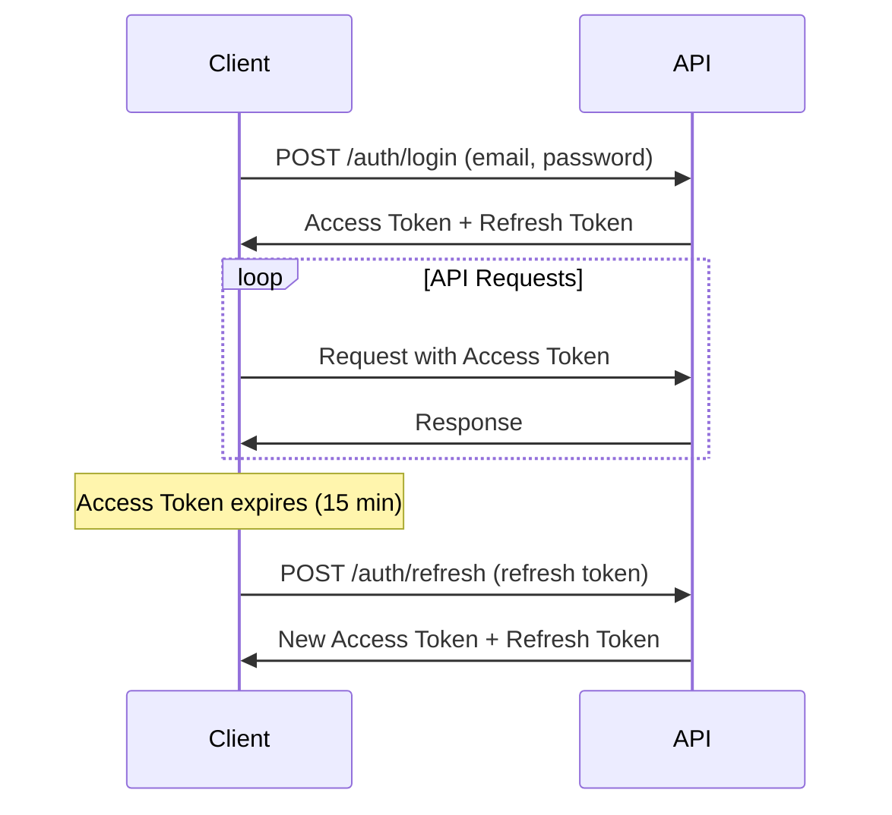

# Authentication Guide

This guide covers authentication flows, token management, and account management for the Authentication Service.

## Token-Based Authentication

The service uses JWT (JSON Web Tokens) for authentication with a dual-token approach:

- **Access Token**: Short-lived (15 minutes) for API requests
- **Refresh Token**: Long-lived for obtaining new access tokens

### Token Flow



## Authentication Methods

### 1. Email/Password Authentication

**Registration Flow:**

```javascript
// Register new user
const response = await fetch("/auth/register", {
  method: "POST",
  headers: { "Content-Type": "application/json" },
  body: JSON.stringify({
    firstName: "John",
    lastName: "Doe",
    email: "john@example.com",
    password: "SecurePassword123!",
  }),
});

const { user, tokens } = await response.json();
```

**Login Flow:**

```javascript
// Login existing user
const response = await fetch("/auth/login", {
  method: "POST",
  headers: { "Content-Type": "application/json" },
  body: JSON.stringify({
    email: "john@example.com",
    password: "SecurePassword123!",
  }),
});

const { user, tokens } = await response.json();
```

### 2. Social Authentication (OAuth)

**Available Providers:**

- Google OAuth2
- GitHub OAuth
- LinkedIn OAuth

**OAuth Flow:**

1. Redirect user to `/auth/oauth/:provider`
2. User completes OAuth on provider's site
3. Provider redirects to `/auth/oauth/:provider/callback`
4. Service processes OAuth and redirects with tokens

**Example Implementation:**

```javascript
// Initiate Google OAuth
function loginWithGoogle() {
  window.location.href = "/auth/oauth/google";
}

// Handle OAuth callback (in your callback page)
function handleOAuthCallback() {
  const urlParams = new URLSearchParams(window.location.search);
  const token = urlParams.get("token");
  const error = urlParams.get("error");

  if (error) {
    console.error("OAuth failed:", error);
    return;
  }

  if (token) {
    localStorage.setItem("accessToken", token);
    // Redirect to dashboard or fetch user info
  }
}
```

## Token Management

### Automatic Token Refresh

Implement automatic token refresh for seamless user experience:

```javascript
class AuthClient {
  constructor(baseURL) {
    this.baseURL = baseURL;
    this.accessToken = localStorage.getItem("accessToken");
    this.refreshToken = localStorage.getItem("refreshToken");
  }

  async request(endpoint, options = {}) {
    try {
      return await this.makeRequest(endpoint, options);
    } catch (error) {
      // If token expired, try to refresh and retry
      if (error.status === 401 && this.refreshToken) {
        await this.refreshTokens();
        return await this.makeRequest(endpoint, options);
      }
      throw error;
    }
  }

  async makeRequest(endpoint, options) {
    const response = await fetch(`${this.baseURL}${endpoint}`, {
      ...options,
      headers: {
        "Content-Type": "application/json",
        Authorization: `Bearer ${this.accessToken}`,
        ...options.headers,
      },
    });

    if (!response.ok) {
      const error = await response.json();
      throw { status: response.status, ...error };
    }

    return await response.json();
  }

  async refreshTokens() {
    const response = await fetch(`${this.baseURL}/auth/refresh`, {
      method: "POST",
      headers: { "Content-Type": "application/json" },
      body: JSON.stringify({ refreshToken: this.refreshToken }),
    });

    if (!response.ok) {
      // Refresh failed, redirect to login
      this.logout();
      throw new Error("Session expired");
    }

    const { tokens } = await response.json();
    this.accessToken = tokens.accessToken;
    this.refreshToken = tokens.refreshToken;

    localStorage.setItem("accessToken", this.accessToken);
    localStorage.setItem("refreshToken", this.refreshToken);
  }

  logout() {
    localStorage.removeItem("accessToken");
    localStorage.removeItem("refreshToken");
    window.location.href = "/login";
  }
}

// Usage
const auth = new AuthClient("https://your-api-domain.com");
const user = await auth.request("/me");
```

### Token Storage Best Practices

**Web Applications:**

```javascript
// Secure token storage for web apps
class SecureStorage {
  static setTokens(tokens) {
    // Use httpOnly cookies for production
    // localStorage for development/demo purposes
    localStorage.setItem("accessToken", tokens.accessToken);
    localStorage.setItem("refreshToken", tokens.refreshToken);
  }

  static getAccessToken() {
    return localStorage.getItem("accessToken");
  }

  static getRefreshToken() {
    return localStorage.getItem("refreshToken");
  }

  static clearTokens() {
    localStorage.removeItem("accessToken");
    localStorage.removeItem("refreshToken");
  }
}
```

**Mobile Applications:**

```javascript
// React Native example with secure storage
import * as SecureStore from "expo-secure-store";

class MobileAuthStorage {
  static async setTokens(tokens) {
    await SecureStore.setItemAsync("accessToken", tokens.accessToken);
    await SecureStore.setItemAsync("refreshToken", tokens.refreshToken);
  }

  static async getAccessToken() {
    return await SecureStore.getItemAsync("accessToken");
  }

  static async getRefreshToken() {
    return await SecureStore.getItemAsync("refreshToken");
  }

  static async clearTokens() {
    await SecureStore.deleteItemAsync("accessToken");
    await SecureStore.deleteItemAsync("refreshToken");
  }
}
```

## Account Management

### Email Verification

All registered users must verify their email addresses:

```javascript
// Verify email with token from email
async function verifyEmail(token) {
  const response = await fetch("/auth/verify-email", {
    method: "POST",
    headers: { "Content-Type": "application/json" },
    body: JSON.stringify({ token }),
  });

  if (response.ok) {
    console.log("Email verified successfully");
  } else {
    const error = await response.json();
    console.error("Verification failed:", error.error);
  }
}

// Resend verification email
async function resendVerification(email) {
  const response = await fetch("/auth/resend-verification", {
    method: "POST",
    headers: { "Content-Type": "application/json" },
    body: JSON.stringify({ email }),
  });
}
```

### Multiple Email Management

Users can manage multiple email addresses:

```javascript
// Add new email to account
async function addEmail(emailAddress, accessToken) {
  const response = await fetch("/me/emails", {
    method: "POST",
    headers: {
      "Content-Type": "application/json",
      Authorization: `Bearer ${accessToken}`,
    },
    body: JSON.stringify({ emailAddress }),
  });

  if (response.ok) {
    console.log("Email added, verification sent");
  }
}

// Set primary email (must be verified)
async function setPrimaryEmail(emailAddress, accessToken) {
  const response = await fetch("/me/emails/primary", {
    method: "PUT",
    headers: {
      "Content-Type": "application/json",
      Authorization: `Bearer ${accessToken}`,
    },
    body: JSON.stringify({ emailAddress }),
  });
}

// Remove email from account
async function removeEmail(emailAddress, accessToken) {
  const response = await fetch(
    `/me/emails/${encodeURIComponent(emailAddress)}`,
    {
      method: "DELETE",
      headers: {
        Authorization: `Bearer ${accessToken}`,
      },
    },
  );
}
```

### Account Linking Behavior

The service implements intelligent account management for OAuth providers:

#### Registration with Existing Email

- **Email/Password Registration**: ❌ **Rejected with `409 Conflict`**
- **OAuth Registration**: ✅ **Smart Account Linking**

#### OAuth Account Linking Flow

When using OAuth with an existing email address:

1. **Existing Account Found**: OAuth provider links to existing account
2. **No Existing Account**: New account created with OAuth provider
3. **Multiple OAuth Providers**: All providers with same email link to single account

**Example Flow:**

```plaintext
1. Register: john@example.com with password ✅ Account created
2. Login with Google (john@example.com) ✅ Google linked to existing account
3. Login with GitHub (john@example.com) ✅ GitHub also linked to same account
4. Try to register again with john@example.com ❌ Registration rejected
```

### Password Management

```javascript
// Change password (requires current password)
async function changePassword(currentPassword, newPassword, accessToken) {
  const response = await fetch("/me/password", {
    method: "PUT",
    headers: {
      "Content-Type": "application/json",
      Authorization: `Bearer ${accessToken}`,
    },
    body: JSON.stringify({
      currentPassword,
      newPassword,
    }),
  });

  if (response.ok) {
    console.log("Password changed successfully");
  }
}

// Password reset flow (implementation depends on your frontend)
async function requestPasswordReset(email) {
  const response = await fetch("/auth/password-reset", {
    method: "POST",
    headers: { "Content-Type": "application/json" },
    body: JSON.stringify({ email }),
  });
}
```

## Session Management

### Logout Implementation

```javascript
// Client-side logout
function logout() {
  // Clear tokens
  localStorage.removeItem("accessToken");
  localStorage.removeItem("refreshToken");

  // Close any open EventSource connections
  if (eventSource) {
    eventSource.close();
  }

  // Redirect to login page
  window.location.href = "/login";
}

// Optional: Server-side session invalidation
async function logoutWithServerInvalidation(accessToken) {
  try {
    await fetch("/auth/logout", {
      method: "POST",
      headers: {
        Authorization: `Bearer ${accessToken}`,
      },
    });
  } catch (error) {
    console.error("Server logout failed:", error);
  } finally {
    // Always clear local tokens
    logout();
  }
}
```

### Multi-Device Session Management

```javascript
// Check if user is logged in on page load
async function checkAuthStatus() {
  const accessToken = localStorage.getItem("accessToken");

  if (!accessToken) {
    redirectToLogin();
    return;
  }

  try {
    const response = await fetch("/auth/me", {
      headers: { Authorization: `Bearer ${accessToken}` },
    });

    if (response.ok) {
      const user = await response.json();
      console.log("User authenticated:", user);
      return user;
    } else {
      // Try to refresh token
      await refreshTokens();
      return await checkAuthStatus();
    }
  } catch (error) {
    console.error("Auth check failed:", error);
    redirectToLogin();
  }
}
```

## Security Considerations

### Progressive Account Lockout

The service implements progressive lockout to prevent brute force attacks:

- Failed login attempts trigger increasingly longer lockouts
- Lockout levels: 1 minute → 5 minutes → 15 minutes → 1 hour
- Account unlocks automatically after lockout period
- Admins can manually unlock accounts

### Rate Limiting

Authentication endpoints have strict rate limits:

- **Login/Register**: 5 requests per 15 minutes per IP
- **Token refresh**: Standard rate limits apply
- **OAuth endpoints**: Protected against abuse

### Token Security

- **Access tokens** expire in 15 minutes
- **Refresh tokens** are single-use and rotate on refresh
- Tokens are signed with secure secrets
- Invalid tokens are rejected immediately

## Common Integration Patterns

### Framework Integration Examples

**React Hook:**

```javascript
function useAuth() {
  const [user, setUser] = useState(null);
  const [loading, setLoading] = useState(true);

  useEffect(() => {
    checkAuthStatus();
  }, []);

  const login = async (email, password) => {
    const response = await fetch("/auth/login", {
      method: "POST",
      headers: { "Content-Type": "application/json" },
      body: JSON.stringify({ email, password }),
    });

    if (response.ok) {
      const { user, tokens } = await response.json();
      localStorage.setItem("accessToken", tokens.accessToken);
      localStorage.setItem("refreshToken", tokens.refreshToken);
      setUser(user);
      return user;
    } else {
      throw new Error("Login failed");
    }
  };

  return { user, loading, login, logout };
}
```

**Vue.js Store:**

```javascript
export const useAuthStore = defineStore("auth", {
  state: () => ({
    user: null,
    accessToken: localStorage.getItem("accessToken"),
    refreshToken: localStorage.getItem("refreshToken"),
  }),

  actions: {
    async login(email, password) {
      const response = await fetch("/auth/login", {
        method: "POST",
        headers: { "Content-Type": "application/json" },
        body: JSON.stringify({ email, password }),
      });

      if (response.ok) {
        const data = await response.json();
        this.setTokens(data.tokens);
        this.user = data.user;
        return data;
      } else {
        const error = await response.json();
        throw new Error(error.error);
      }
    },

    setTokens(tokens) {
      this.accessToken = tokens.accessToken;
      this.refreshToken = tokens.refreshToken;
      localStorage.setItem("accessToken", tokens.accessToken);
      localStorage.setItem("refreshToken", tokens.refreshToken);
    },
  },
});
```
